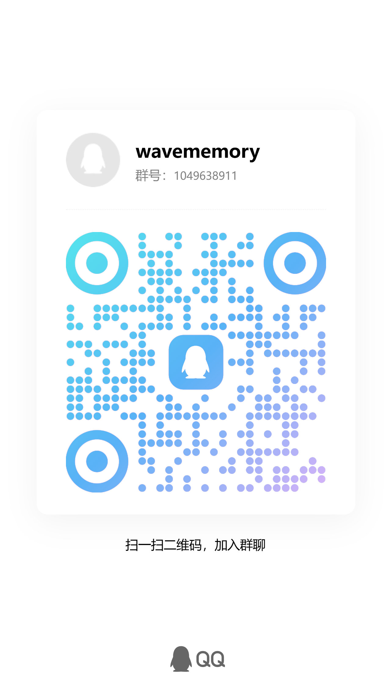

<div align="center">

# Wave Memory

[](https://github.com/vivy1024/astrbot_plugin_wave_memory/releases)
[](https://www.gnu.org/licenses/agpl-3.0)
[](https://www.python.org/downloads/)
[](https://github.com/AstrBotDevs/AstrBot)

**给长期群 Bot 用的记忆层：记住这个群说过什么、谁是谁、关系好不好；回复时把相关记忆和其他通道一起注入。**

v5 起，事实 / 黑话 / 信念 / 风格不再靠后台定时盲抽，而是对话现场由模型调工具提审，管理台人工审核后再注入。日常检索仍只依赖 Embedding，本地 SQLite 毫秒级召回。

[快速开始](#快速开始) · [为什么选我们](#为什么选我们) · [适合谁](#适合谁不适合谁) · [检索引擎](#-检索引擎) · [灵魂系统](#-灵魂系统) · [WebUI](#-webui-管理面板) · [Releases](https://github.com/vivy1024/astrbot_plugin_wave_memory/releases)

</div>

---

### 能做什么

- **记住群聊**：把对话写成长期记忆，按当前 Bot 和群检索，注入到下一次回复；意图门禁自动识别追忆意向。
- **记住群友**：昵称、别名、好感度与事实；同一用户在不同群累加的情感和事实自动合并（不跨 Bot），记忆检索受跨群开关控制。
- **像群友一样说话**：本群黑话和 Bot 回复风格由现场工具提审，管理台通过后才注入。
- **有心情和关系**：印象时间线、五维好感（跨群累加）；人情账可写备忘但不注入账单。关切是人味临场发挥，不再按字数截句入库。
- **事实要原话，信念要二次审**：提事实必须带群友原话；黑话只用来听懂原话，反串不升格为认真事实。信念必须挂至少两条已审事实。
- **能看见一次回复用了什么**：注入观测台按通道列出命中、跳过、错误和最终文本。
- **中文管理台 + 3D 图谱**：记忆、人物、标签、事实、黑话、心智都在 9876 端口；神经云图看记忆和关系。

三种模式：`full` 完整人格；`memory_only` 只要记忆注入；`compat_only` 给 SelfLearning / ChatPlus 当记忆后端，避免两套记忆一起注入。

---

### 💡 核心认知范式转向：从「后台盲抽」到「模型自主提审」

在 **v5.0.0** 之前，系统依赖定时后台脚本（Consolidation / Jargon Mine / Belief Emerge）去全表扫描聊天记录，截取碎屑拼凑事实与信念。这容易产生大量复读机垃圾、把群友反串当成严肃事实，还容易锁表引发死锁。

**v5.0.0 起，认知沉淀全面转向由大模型在现场对话与事后反思中自主感知并调用工具提审**：

```
真实群聊互动 / 纠正信号 / 夜间定时回顾
     ↓
大模型现场感知并触发自主提审工具 (Function Calling)
     ├─ 提审事实 (wave_memory_propose_fact)：必须附带群友原话 (source_quote)，反串不升格为客观事实
     ├─ 提审信念 (wave_memory_propose_belief)：信念必须锚定至少 2 条当前群已审核的事实，拒绝无根虚妄感悟
     ├─ 提审黑话 (wave_memory_mark_cultural_moment)：沉淀本群真实高频梗，配合 Holyman 词典只读理解
     ├─ 亲笔日记 (wave_memory_record_diary_episode)：Bot 记录成长大事件，自动钉入经历时间线
     └─ 人情与好感 (wave_memory_note_social_anchor / record_social_impression)：动态结算群友账本
     ↓
统一进入 WebUI「审查登记表 (review_candidates)」
     ↓
管理员在 9876 管理台人工批准 → 正式进入多通道注入生效！
```

- **大模型什么时候会主动提审？**
  1. **日常对话反思触发**：当群聊经历一段密集交互或出现群友纠正信号时，底层反思引导向大模型精准下发 8 个专用提审工具的调用指令；
  2. **夜间定时日记回顾**：通过 AstrBot 原生 Cron 任务，Bot 可调用 `wave_memory_browse_recent_chat` 翻阅近期聊天流水，总结今日日记并提审关键事实。

---

### 为什么选我们

1. **日常检索只依赖向量模型**  
   写入和召回用 Embedding + 本地 HNSW / 全文检索。回复当下的记忆搜索不再调聊天大模型。实测十万级记忆本地查询 < 50ms；加上远程 Embedding 大约 850ms。不装 Neo4j、Elasticsearch、独立向量库。

2. **记忆注入不是单独塞几条**  
   一次回复可以同时带上：相关记忆、人名精确命中、时间线、事实、人物画像/好感、已审核信念、本群黑话、风格样例、书设定。安全通道会去掉刚聊过的重复内容和身份污染。各通道超时互不影响，总预算可裁。

3. **配置自由度高，能关也能细调**  
   - 整机模式：`full` / `memory_only` / `compat_only`  
   - 每个注入通道可单独开关、调优先级、条数、token 预算、超时、最低分  
   - 检索算法（脉冲/残差金字塔/EPA/测地线）可关；跨群权重、黑话频率、风格评分、好感衰减都能改  
   - 不想要人格时只开记忆注入；已有人格插件时可以只当记忆后端

4. **按 Bot 和群隔离，能审计**  
   A 群的梗和好感不会当成 B 群的。管理台能看见「这句话用了哪些通道、为什么跳过」，黑话/信念/风格要审核后才进人格。

### 限制

- **不是轻量插件**：要比「只塞最近 N 条」更占磁盘和内存；十万级记忆大约 1.7GB SQLite + 几百 MB 索引。
- **必须配 Embedding**；学黑话、打标签、风格范例还要配 Tag LLM。没有这两个，完整能力起不来。
- **单机本地库**：数据在这台 AstrBot 上，不能开箱多机共享一份云端记忆。
- **主要面向 QQ 群**（aiocqhttp）。私聊、未绑定群只能看，不能当正式群身份来写。
- **管理台是独立 9876 端口**，不是 AstrBot 自带设置页。
- **不会替你写完整人设**，也不会自动改其他插件的配置。

### 适合谁 / 不适合谁

| 选 WaveMemory | 另找轻量方案 |
|---------------|--------------|
| 要长期陪聊群 Bot，记得住群史、黑话、群友关系 | 只要最近几轮上下文或一句摘要 |
| 想自己审核黑话 / 信念 / 风格再注入 | 不想维护 Embedding 和本地索引 |
| 已经有人格插件，需要一个可隔离的记忆后端 | 需要多机共享、云端托管的记忆服务 |
| 能接受单独开一个中文管理台做排查 | 只想在 AstrBot 设置里勾一个开关 |

### Recent Releases

| 版本 | 日期 | 重点 |
|------|------|------|
| **v5.0.0** | 2026-09-09<br>（09-12 修订） | 现场提审取代后台盲抽 + Bot 亲笔日记；修复反思引导静默瘫痪 bug 并写明确切工具名；索引诊断性能暴提 23 倍防超时；标签星云内嵌自由无限制控制台 + 交互式类型透镜 + 算法实验室拓扑联想联动；真实 9 大标签类型（事件/人物/地点/时间）全链路色彩对齐；WebUI 全量中文脱敏与配置折叠分组<br>**09-12 修订**：好感度改为跨群累加（同一人各群积累合成一份态度，实测 0→33）、事实去群限制、修复 WebUI 记忆作业始终失败；清理死模块/死函数/废弃配置/零引用脚本净减约 4200 行；README 配置参考 6%→100% 并加防漂移测试 |
| **v4.7.2** | 2026-08-29 | 中文管理台与心智自省：人物历史关系审计、表格/筛选重构、去掉后端黑话 |
| **v4.7.1** | 2026-08-06 | 稳定性修复与好感度平滑：发送前拦截清洗印象标记防泄露、WriteCoordinator死锁与共现循环防御、关系衰减优化、向量索引恢复 Inline Resize |
| **v4.7.0** | 2026-07-26 | 瘦身重构 + 3D 增强：清理学习中心空壳(−11K行)、CDN 本地化、力导向聚类、节点降噪、经历/时间锚点/Outbox 新页面 |
| **v4.6.3** | 2026-07-21 | 开放 Scope 检索、跨群同文 soft-delete、热 HNSW 对齐读路径、person 跨群与观察门禁 |
| **v4.6.2** | 2026-07-20 | 数据库治理 Phase 0：稳定标签 upsert、Schema 兼容迁移、2000ms 注入预算与 Scoped Runtime 诊断 |
| **v4.6.0** | 2026-07-19 | Scoped Runtime、Tag 治理、Learning Center、关系/Soul、受限 HNSW 热冷召回与全历史 Timeline |
| **v4.5.0** | 2026-07-06 | 前端优化 + 认知资源管理：BookLore/FewShot/Facts/People/Indexes 独立 API 与真实数据闭环 |
| **v4.2.1** | 2026-07-05 | Holyman GitHub 更新握手：轻量检查缓存 · 强制刷新 · 预览确认同步 · lint 清零 |
| **v4.2.0** | 2026-07-05 | React WebUI Holyman 黑话治理补全：筛选/批量审核 · 显式命中注入 · 神经云图与审计 UI 修复 |
| **v4.1.0** | 2026-07-03 | 3D神经云图星空版：动力学引力 · 3D粒子流数据线 · 高分屏精准点击 · WebGL彻底销毁自愈 |
| **v4.0.0** | 2026-07-03 | React WebUI首发：Vite + React + TS + Tailwind v4 + shadcn/ui 全量管理页面迁移 |
| **v3.3.0** | 2026-07-03 | Holyman 分层黑话资产重建 · 精选运行时匹配过滤 |
| **v3.2.0** | 2026-07-03 | 通道化注入编排器 · 注入 Trace 持久存储 · Agent 只读/受控反馈工具 |
| **v3.1.0** | 2026-07-03 | 运行模式 · 通道配置热更新模型 · 学习对象审查登记表 |
| **v3.0.1** | 2026-07-03 | 性能优化：优化 SQLite 缓存与 HNSWlib/EPA 内存消耗 |
| **v3.0.0** | 2026-06-30 | PersonaComposer 分层人格 · 主动对话共用自我人格上下文 · few-shot 健康过滤 · 安全边界收口 |
| **v2.3.4** | 2026-06-30 | Holyman 黑话知识库分层 · 候选批量审核 · 证据层 tabs · 屏蔽项回显 |
| **v2.3.2** | 2026-06-27 | 注入指标时间序列 · SVG 折线图 · 模块消耗排行榜 · 自定义日期筛选 |

---

## 定位与边界

WaveMemory 是 AstrBot 记忆插件：负责记录、整理、检索、注入、审计和反馈记忆。

| 是 | 不是 |
|----|------|
| 记忆存储与召回后端 | 插件总线 |
| 注入通道编排器 | 通用学习系统 |
| 记忆/事实/信念/风格/黑话等学习对象审计 | 自动改其他插件配置的控制器 |
| LivingMemory-compatible facade | `astrbot_plugin_livingmemory` 伪装 |

### 运行模式

| 模式 | 自动注入 | 默认能力 | 适用场景 |
|------|----------|----------|----------|
| `full` | 开 | 基础记忆 + 高级通道 + WebUI + Agent 反馈 | WaveMemory 独立承担记忆与人格增强 |
| `memory_only` | 开 | 消息采集、writer、向量检索、基础记忆注入、trace、搜索/记住工具、兼容 facade | 只要记忆，不要人格/黑话/BookLore/few-shot/mood 等高级能力 |
| `compat_only` | 关 | writer、query、LivingMemory-compatible facade、可选工具别名、最小 trace | 给 SelfLearning/ChatPlus 等外部插件当记忆后端，避免重复注入 |

---

## 🧠 检索引擎


查询路径零 LLM 调用。五阶段纯计算管线，用算法替代外部基础设施。

```
用户消息 → Embedding
     ↓
┌─ EPA 嵌入投影分析 ─────────────────────────────────────┐
│  PCA 投影查询向量 → 能量分布熵 → logic_depth (聚焦度)   │
│  聚焦 → 精确搜索    发散 → 积极联想                     │
└────────────────────────────────────────────────────────┘
     ↓
┌─ 残差金字塔 (Gram-Schmidt 正交分解) ──────────────────┐
│  逐层剥离已理解的语义，确保复合查询每个面都被召回       │
└────────────────────────────────────────────────────────┘
     ↓
┌─ 脉冲传播 (有向共现图能量扩散) ───────────────────────┐
│  多跳扩散 · 虫洞机制 · 内生残差加权 · 动态动量         │
│  发现查询中未直接提及但语义关联的记忆                   │
└────────────────────────────────────────────────────────┘
     ↓
┌─ 向量融合 + HNSW 检索 ───────────────────────────────┐
│  (1-α)×原始查询 + α×联想上下文 → cosine top-k          │
└────────────────────────────────────────────────────────┘
     ↓
┌─ 测地线重排 ──────────────────────────────────────────┐
│  共现图路径距离修正向量直线距离 · 三级降级保鲁棒        │
└────────────────────────────────────────────────────────┘
     ↓
   Top-K 记忆
```

### 核心算法模块

| 模块 | 原理 | 解决什么问题 |
|------|------|-------------|
| EPA | PCA 投影 → 能量熵 → 聚焦度 | 自适应调节检索激进度 |
| 残差金字塔 | Gram-Schmidt 逐层正交分解 | 复合查询多面召回 |
| 脉冲传播 | 图 BFS + 能量衰减 + 虫洞 | 间接关联发现 |
| 测地线重排 | 图拓扑距离修正余弦距离 | 语义流形曲率补偿 |
| 内生残差 | SVD 邻居子空间不可解释度 | 信息价值度量 |
| 语义增益 | 钟形函数 · 黄金邻接区 | 过滤冗余/噪声共现 |
| 有向共现矩阵 | 序位势能 × 语义增益 × 残差锚定 | 替代图数据库 |
| FTS5 | SQLite 全文搜索 | 精确人名/专有名词 |

### 并行注入通道

`InjectionOrchestrator` 并发运行 **12** 条通道；每通道独立 `timeout_ms`，单通道 timeout/error 不阻塞整体注入。总耗时超过 2000ms 打慢注入警告。

```
├─ safety（近期上下文去重 · 身份污染过滤）
├─ memory（五阶段语义召回）
├─ fts5（人名/专有名词精确命中）
├─ facts（三元组事实，本群与全群都可见）
├─ persona（自我人格 / 精选经历 / 当前发言者统计）
├─ belief（已审核信念）
├─ jargon（已确认黑话）
├─ fewshot（已批准健康风格样本）
├─ book_lore（世界观知识）
├─ affinity（全群累加的好感、印象时间线、人情账、已审事实）
├─ holyman_persona（holyman-skills 风格人格包，默认关闭）
└─ soul_state（当前群情绪 valence/arousal、关切、时间线）
```

通道配置在 9876 WebUI「通道配置」热更新：`enabled`、`priority`、`top_k/max_items`、`token_budget`、`timeout_ms`、`min_score`。

### Benchmark

5 个 QQ 群，持续运行 80+ 天：

| 指标 | 数值 |
|------|------|
| 记忆规模 | 126,000+ 条 |
| 共现图 | 133,000 节点 / 447,000 有向边 |
| 查询延迟（本地计算） | < 50ms |
| 端到端延迟（含远程 Embedding） | ~850ms |
| 存储 | 1.7GB SQLite + 592MB HNSW |
| 外部依赖 | 零（仅需 Embedding API） |

---

## 💬 灵魂系统

独立于检索引擎的人格模拟层。让 bot 不只是"能记住"，而是"像人一样成长"。

### 认知与情感

| 模块 | 功能 |
|------|------|
| PersonaComposer | 编排自我人格、精选自我经历与审核信念；不塞虚假的群友刻板画像 |
| BeliefEngine | 维护已审核稳定判断；只注入当前群 active 信念 |
| 现场提审工具 | 印象 / 人情 / 黑话 / 事实 / 信念由主对话 LLM 按需调用，进入 pending 审核 |
| MoodTrajectory | 群聊密度与情绪 tag 影响 valence/arousal；由 `soul_state` 通道注入近期心境 |
| SubjectiveTime | 代码仅初始化保留，经历时间线注入直接来源于 Bot 亲笔日记（`scoped_soul_timeline`） |
| ConcernTracker | 关切只读展示；v5 不再从入站消息截词入库 |
| DesireEngine | 代码仅初始化保留，**当前回复路径不调用** `trigger` / `resolve` |

### 社交认知

| 功能 | 说明 |
|------|------|
| 跨群好感累加 | 同一人在所有群的好感维度与情感积累自动合并为一份统一态度（模拟真人认识你不分场合） |
| 广域客观事实 | 注入已审核事实，本群与全群皆可见；提审必须带原话，反串黑话不得当认真事实 |
| 跨群记忆检索 | `cross_group_enabled` 控制记忆语义召回能否看到其他群；`shared_memory_grants_enabled` 支持共享记忆只读授权 |
| 别名识别 | `person_registry` 维护群友真实别名，支持多群同人识别 |
| 多 Bot 隔离 | 2+ Bot 共存时互动与认知数据严格隔离，`bot_id` 使用 `BotProfile.db_id` 区分 |
| 防骚扰机制 | 辱骂累计到阈值后冷却静默（时间翻倍，上限 1 小时） |
| 身份安全防线 | 拦截认爹/认主/契约/猫娘/RP 等身份污染，不写入长期人格 |
| 攻击反制边界 | 针对 Bot 的恶意攻击由安全通道与反思机制联合设防，达到阈值后冷却不回 |

### 自主学习

| 模块 | 功能 |
|------|------|
| SelfReflect | 接收群友纠正信号 → 搜索历史记忆与知识 → 内化为高权重自省记忆 |
| DreamService | 6h 周期离线联想，强化近期重要记忆 |
| 现场感知提审 | 彻底废除定时抽取盲抽，事实/信念/黑话改由现场对话大模型精准提审 |

### 文化融入

| 模块 | 功能 |
|------|------|
| 黑话系统 | 入站只记账；新梗由 `mark_cultural_moment` 提审；Holyman 广域词典只读理解 |
| Holyman 知识库 | 精选词条 / 文化概念 / 语录证据 / 原始语料 / 候选 / 屏蔽项分层管理 |
| Few-Shot 风格 | 高光回复写入正式 `review_candidates`（须带当轮消息 id），仅注入已批准健康范例 |
| 关切 / 人味 | 不入库截词。注入提供人情账与已审事实，模型自己决定要不要问吃饭、认投喂、回礼 |

### 记忆生命周期

```
新消息写入 (importance=1.0)
  → 被做梦联想触发 +0.05 权重提升 (每轮最多强化 50 条)
  → 检索时动态加权：时间衰减系数 ×0.997^天
  → 定期淘汰：noise 记忆超过保存期限 (默认 7 天) 自动彻底清理
```

---

## 📊 WebUI 管理面板

管理台在 **9876** 端口，中文界面。运行时由 Python 托管已构建的前端，不需要在生产环境装 Node.js。

| 页面 | 功能 |
|------|------|
| 总览 | 健康状态、待办、近期异常 |
| 神经云图 | 3D 全模态全息记忆宇宙（融合记忆/事实/信念/人物/书设定等多层数据） |
| 标签神经星云 | 2D 标签共现突触星图；内嵌 HUD 自由控制台（节点数/置信度/脉冲自由调节）与内置算法实验室（在图上直观观察脉冲与残差金字塔拓扑联想） |
| 算法实验室 | 高级检索算法对比与调参验证（EPA / 残差金字塔 / 脉冲共现 / 测地线重排） |
| 记忆 / 标签 / 导入 | 按群查看和编辑记忆、打标签、从来源预检导入；支持单条与批量重新向量化 |
| 维护任务 / 注入观测台 / 通道配置 | 后台任务、一次回复用了哪些通道、通道开关与预算 |
| 审查队列 | 模型自主提审的 memory / fact / belief / style / jargon 候选统一待审区；人工批准后才入库生效 |
| 信念 / 黑话与口癖 / 心智状态 | 审核信念和黑话，查看心情轨迹、关切状态与经历时间线 |
| 书设定 / 经历 / 风格样例 / 事实 / 人物 | 只读或审核知识对象；事实必须带原话，人物页支持全量群友印象时间线检索与好感校准 |
| 索引诊断 / 生态兼容 / 系统配置 | 海量数据秒级探针诊断（FTS/向量/Outbox/派生投影）；系统配置按功能分组折叠 |
| 登录 | 管理台访问鉴权（`webui_password`） |

**系统配置页**按功能分组折叠（记忆召回 / 心智与情绪 / 标签与分类…），常用组默认展开，搜索时自动展开命中分组。每个字段标注真实生效方式：热生效 / 保存即生效 / 重启生效；侧栏显示从 `metadata.yaml` 读取的插件版本。

开发命令：

```bash
cd webui/frontend && npm install
cd webui/frontend && npm run dev
cd webui/frontend && npm run typecheck
cd webui/frontend && npm run build
```

发布约定：提交 `webui/static/app/index.html` 与 hashed JS/CSS 静态产物；后端 `/` 优先服务 React 构建产物，产物缺失时自动 fallback 到旧版首页。

---

## 🔧 Agent 工具

工具注册受运行模式门控；`compat_only` 默认只保留 LivingMemory-compatible 别名（开启时）。

| 工具 | 功能 | 权限 |
|------|------|------|
| wave_memory_search | 五阶段语义搜索 | allowed |
| wave_memory_deep_search | FTS5 全文关键词搜索 | allowed |
| wave_memory_person_search | 人物记忆/画像/社交关系 | full/memory_only |
| wave_memory_affinity | 关系/互动查询 | full |
| wave_memory_facts | 事实知识三元组 | allowed |
| wave_memory_tag_graph | 标签共现图谱探索 | allowed |
| wave_memory_remember | 主动存储重要信息 | allowed，走统一 writer 去重 |
| wave_memory_explain_injection | 读取 trace，解释通道命中/过滤/预算/耗时 | read-only |
| wave_memory_feedback_memory | 对 trace 中命中的 memory 记录 useful/useless/misleading/duplicate | 低风险 useful 可软提升 |
| wave_memory_suggest_config | 基于 trace 证据提交配置建议 | pending_review，不自动应用 |
| wave_memory_record_social_impression | 记录主观印象并在动态范围内裁决好感 | full，群 Scope |
| wave_memory_note_social_anchor | 人情借还 / 承诺 / 越界备忘，可挂未了往来 | full，群 Scope |
| wave_memory_mark_cultural_moment | 提审本群黑话或高光回复（style 进审查队列） | full，群 Scope |
| wave_memory_note_concern | 管理 Bot 内部关切状态 | full，群 Scope |
| wave_memory_note_episode | 记录群经历片段 | full，群 Scope |
| wave_memory_record_diary_episode | Bot 亲笔日记，钉入经历时间线 | full，群 Scope |
| wave_memory_browse_recent_chat | 浏览群聊近期流水（配合 Cron 主动回顾） | full，群 Scope |
| wave_memory_affinity_update | 按上限调整好感维度 | full，群 Scope |
| wave_memory_propose_fact | 提审客观事实，必填原话 | full，群 Scope |
| wave_memory_propose_belief | 提审稳定判断，须 ≥2 条已审事实 | full，群 Scope |
| wave_memory_submit_review_candidate | 提交 memory/fact/belief/style/jargon 候选 | pending_review，不自动提升 |
| book_lore_search | 书设知识库语义搜索 | full |
| book_lore_graph | 书设实体关系图谱 | full |
| recall_long_term_memory | LivingMemory 风格搜索别名 | 可选，默认关闭 |
| memorize_long_term_memory | LivingMemory 风格写入别名 | 可选，默认关闭 |

---

## 🚀 快速开始

### 安装

将插件目录放入 AstrBot `data/plugins/`，自动安装依赖。

### 配置

| 配置项 | 说明 | 推荐值 |
|--------|------|--------|
| `embedding_provider_id` | Embedding 模型 | `siliconflow/Qwen3-Embedding-0.6B` |
| `tag_llm_provider_id` | Tag/黑话/风格用 LLM | `xiaomi/mimo-v2.5-pro` |
| `embedding_dimension` | 向量维度 | `1024` |

AstrBot >= 4.14.0 · Python 3.10+ · WebUI 默认端口 9876

---

## 📋 配置参考

所有参数可在 AstrBot 6185 配置页调整，部分也可在 9876 WebUI 实时修改。

### 基础配置（顶层字段）

| 配置项 | 默认值 | 说明 |
|--------|--------|------|
| embedding_provider_id | （必填） | Embedding 模型 Provider ID |
| tag_llm_provider_id | （必填） | Tag/黑话/风格用 LLM |
| embedding_dimension | 1024 | 向量维度 |
| llm_fallback_provider_ids | （空） | LLM 降级 Provider 链 |
| backup_max_count | 1 | 数据库备份保留份数 |
| _system_status | （只读） | 仅供说明，无需修改 |

### 运行模式 (Runtime_Settings)

| 配置项 | 默认值 | 说明 |
|--------|--------|------|
| runtime_mode | full | 系统运行级别 |

### 记忆召回 (Query_Settings)

| 配置项 | 默认值 | 说明 |
|--------|--------|------|
| enable_auto_inject | true | 开启自动记忆注入能力 |
| inject_top_k | 5 | 单次最多注入几条记忆 |
| min_similarity | 0.35 | 相似度关联召回门限 |
| injection_format | `<memory from='{sender}' time…` | 记忆提示词注入模板 (Template) |
| enable_spike_routing | true | 启用神经星云脉冲传播 (Spike Routing) |
| enable_residual_pyramid | true | 启用残差多阶金字塔召回 (Residual Pyramid) |
| enable_epa | true | 启用自省投影距离修正 (EPA) |
| enable_geodesic_rerank | true | 启用非欧流形测地线重排 (Geodesic) |
| enable_shotgun | false | 启用霰弹枪扫描模式 |

### 注入与时间线 (Inject_Settings)

| 配置项 | 默认值 | 说明 |
|--------|--------|------|
| enable_holyman_persona | false | 启用 holyman-skills 风格人格包（可选） |
| timeline_days | 0 | 历史时间窗（天，兼容保留） |
| timeline_decay_half_life_days | 21 | 印象时间线指数权重半衰期（天） |
| soul_timeline_max_items | 3 | Bot 经历日记时间线注入条数 |
| orchestrator_active_enabled | true | 启用注入编排 |
| orchestrator_shadow_enabled | false | 启用编排影子模式 |
| skip_recent_minutes | 30 | 跳过最近多少分钟的消息 |
| facts_max | 5 | 事实注入条数上限 |

### 注入通道 (Channel_Settings)

| 配置项 | 默认值 | 说明 |
|--------|--------|------|
| layers | （空） | 注入通道优先级图层 |

### 跨群与共享 (Cross_Group_Settings)

| 配置项 | 默认值 | 说明 |
|--------|--------|------|
| cross_group_enabled | true | 开启广域跨群记忆共享 |
| shared_memory_grants_enabled | false | 启用共享记忆只读授权 |

### 存储与容量 (Storage_Settings)

| 配置项 | 默认值 | 说明 |
|--------|--------|------|
| max_memories | 100000 | 活跃记忆软上限（条） |
| canonical_capacity_enabled | true | 启用记忆总量软上限 |
| cold_chat_when_over_capacity | true | 超额时 chat 冷落库 |
| facts_decay_rate | 0.005 | facts 时间衰减速率 |

### 记忆索引 (Memory_Index_Settings)

| 配置项 | 默认值 | 说明 |
|--------|--------|------|
| hot_max_vectors | 40000 | 热记忆最大条数 |
| enforce_scope_hot_quota | false | 启用单个群的热记忆配额 |
| per_scope_max_vectors | 1000 | 单个群的热记忆上限 |
| scoped_reserved_vectors | 10000 | 为正式群保留的热记忆量 |
| chat_hot_days | 30 | 普通聊天热窗口（天） |
| cold_candidate_limit | 128 | 单次冷召回候选上限 |
| cold_recall_enabled | true | 启用标签驱动的冷记忆召回 |
| tag_index_max_vectors | 40000 | 标签索引最大条数 |
| generation_retention | 1 | 索引历史版本保留数量 |

### 内存预算 (Memory_Budget_Settings)

| 配置项 | 默认值 | 说明 |
|--------|--------|------|
| memory_profile | unbounded | 内存预算档位 |
| memory_budget_mb | 2400 | 常驻内存预算（MiB） |
| baseline_reserved_mb | 700 | 非索引基线预留（MiB） |
| rebuild_headroom | 0.35 | 重建峰值预留比例 |

### 性能 (Performance_Settings)

| 配置项 | 默认值 | 说明 |
|--------|--------|------|
| embedding_batch_size | 16 | 向量化批处理大小 |
| write_flush_interval | 1.0 | 数据库写入落盘缓冲间隔（秒） |

### 记忆淘汰 (Eviction_Settings)

| 配置项 | 默认值 | 说明 |
|--------|--------|------|
| enabled | true | 启用记忆淘汰 |
| noise_ttl_days | 7 | 噪声记忆保留天数 |
| interval_hours | 6.0 | 淘汰作业检查间隔（小时） |

### 消息过滤 (Message_Filter)

| 配置项 | 默认值 | 说明 |
|--------|--------|------|
| min_message_length | 4 | 记忆录入最小字符长度 |
| max_message_length | 2000 | 记忆录入最大字符长度 |
| ignore_bot_messages | false | 忽略机器人自身回复记忆 |
| group_whitelist | （空） | 群记忆功能激活白名单 |
| group_blacklist | （空） | 群记忆功能禁止黑名单 |

### 标签提取与图谱 (Tag_Settings)

| 配置项 | 默认值 | 说明 |
|--------|--------|------|
| tag_extraction_enabled | true | 启用标签特征分析 |
| max_tags_per_message | 10 | 单条消息最大标签数 |
| tag_batch_size | 5 | 标签提炼实时队列批次大小 |
| tag_backfill_batch_size | 50 | 后台标签补填任务处理大小 |
| tag_blacklist | （空） | 全局标签屏蔽词 |
| graph_legend_enabled | true | 显示神经星云图例 |
| graph_legend_types | `topic,event,keyword,entity,f…` | 神经星云图例展示类型与顺序 |
| graph_legend_show_count | true | 神经星云图例显示节点数量 |

### 标签队列 (TagWorker_Settings)

| 配置项 | 默认值 | 说明 |
|--------|--------|------|
| worker_enabled | true | 启用后台标签队列 |

### 黑话系统 (Jargon_Settings)

| 配置项 | 默认值 | 说明 |
|--------|--------|------|
| enabled | true | 启用黑话挖掘与注入 |
| min_frequency | 5 | 黑话候选词频门限 |
| min_messages | 10 | 黑话候选消息数门限 |
| confidence_threshold | 0.5 | 推断置信度门限 |
| max_inject | 3 | 单次回复最大注入黑话数 |

### 风格学习 (FewShot_Settings)

| 配置项 | 默认值 | 说明 |
|--------|--------|------|
| enabled | true | 启用 FewShot 风格注入 |
| max_inject | 3 | 单次回复最大注入样例数 |

### 人格与情绪 (Lifecycle_Settings)

| 配置项 | 默认值 | 说明 |
|--------|--------|------|
| enable_mood | true | 启用生理心境系统 (Bot Mood) |
| mood_duration_hours | 2.0 | 情绪状态自然半衰退天数 |
| mood_msg_threshold | 30 | 情绪爆发活跃消息门限 |
| positive_emotion_threshold | 0.6 | CHEERFUL 喜悦触发临界值 |
| negative_emotion_threshold | 0.4 | CONCERNED 悲伤触发临界值 |
| relationship_single_delta_cap | 5.0 | 单次互动关系变化极大值 |
| relationship_daily_delta_cap | 15.0 | 每日好感度变化累计上限 |
| relationship_hostility_delta_cap | 8.0 | 单次辱骂敌意增加上限 |
| enable_dream | true | 启用深夜做梦引擎 (Dreaming) |
| dream_interval_hours | 6.0 | 做梦引擎触发自省间隔 |
| dream_recent_seeds | 3 | 近期种子记忆数 |
| dream_recent_k | 5 | 近期记忆联想召回深度 |
| dream_mid_seeds | 2 | 中期经历种子数 |
| dream_mid_k | 3 | 中期经历联想召回深度 |

### 社交与关系 (Social_Settings)

| 配置项 | 默认值 | 说明 |
|--------|--------|------|
| abuse_trigger_count | 3 | 防骚扰触发阈值 |
| abuse_cooldown_base | 120 | 防骚扰冷却基础时长（秒） |
| abuse_cooldown_max | 3600 | 防骚扰冷却最大时长（秒） |
| aba_window_seconds | 30 | 连续对话判定时间窗（秒） |
| group_weight_current | 1.0 | 当前群记忆匹配权重 |
| group_weight_cross | 0.7 | 跨群记忆匹配权重 |
| impact_cap | 5.0 | 单次交互印象冲击度上限 |
| affinity_step_cap | 2.0 | 阶段性好感单次调整步长上限 |
| affinity_hostility_step_cap | 3.0 | 阶段性敌意单次调整步长上限 |

### 好感校准 (Affinity_Settings)

| 配置项 | 默认值 | 说明 |
|--------|--------|------|
| manual_adjustment_delta_cap | 20.0 | 管理员手动调整好感单次上限 |

### 自省 (Study_Settings)

| 配置项 | 默认值 | 说明 |
|--------|--------|------|
| self_reflect_enabled | true | 启用自省纠错系统 |

### 书设知识库 (BookLore_Settings)

| 配置项 | 默认值 | 说明 |
|--------|--------|------|
| book_lore_db_path | （空） | 书设只读数据库绝对或相对路径 |
| lore_db_path | （空） | 书设别名数据库路径（兼容） |

### Trace (Trace_Settings)

| 配置项 | 默认值 | 说明 |
|--------|--------|------|
| retention_days | 14 | Trace 历史数据保留天数 |
| max_rows | 5000 | Trace 最大保留记录条数 |
| max_preview_chars | 1200 | 单条消息最大预览字符数 |

### 管理台 (WebUI_Settings)

| 配置项 | 默认值 | 说明 |
|--------|--------|------|
| webui_enabled | true | 启用管理控制台 |
| webui_host | 127.0.0.1 | 监听网卡地址 |
| webui_port | 9876 | 控制台访问端口 |
| webui_password | （空） | 访问登录密码 |

### 兼容模式 (Compatibility_Settings)

| 配置项 | 默认值 | 说明 |
|--------|--------|------|
| livingmemory_alias_tools_enabled | false | 启用 LivingMemory 别名工具映射 |
| compat_only_auto_inject_enabled | false | 兼容模式下强行启用原生注入 |

### MetaThinking (MetaThinking_Settings)

| 配置项 | 默认值 | 说明 |
|--------|--------|------|
| enabled | true | 启用 MetaThinking |
| default_model | （空） | 默认模型 |
| spam_threshold | 6 | 刷屏检测阈值 |
| spam_window_seconds | 60 | 刷屏检测窗口（秒） |
| silent_hours_start | 0 | 静默时段开始（小时） |
| silent_hours_end | 6 | 静默时段结束（小时） |
| interest_sample_size | 20 | 兴趣关键词数量 |

### MetaThinking Bot 画像 (MetaThinking_Bot1 / MetaThinking_Bot2)

> `MetaThinking_Bot2` 与 Bot1 字段完全同构，为第二个 Bot 单独配置。`db_id` 是数据库标识（用于 user_profiles / beliefs / concerns 等表），**不是 QQ 号**。

| 配置项 | 默认值 | 说明 |
|--------|--------|------|
| qq_id | 2500447291 | QQ 号 |
| name | 羽书 | 显示名称 |
| db_id | yushu | 数据库标识（用于 user_profiles/beliefs/concerns 等表，不是 QQ 号） |
| aliases | 羽书,羽书bot,器灵 | 别名（逗号分隔，用于兴趣词匹配和纠正检测） |
| exclude_sources | bzz_experience,bzz_pending | 排除的记忆来源（逗号分隔） |
| interest_keywords | 没钱修什么仙,张羽,熊狼狗 | 自定义兴趣关键词（逗号分隔，触发主动对话） |
| meta_prompt | （空） | 自定义 MetaThinking prompt（留空用默认模板） |
| model | （空） | 模型（留空用全局默认） |
| proactive_enabled | true | 启用主动对话 |
| proactive_interval_seconds | 600 | 主动对话最小间隔（秒） |
| proactive_max_per_hour | 3 | 每小时最多主动插话 |
### 与 SelfLearning / ChatPlus 共存

| 目标 | WaveMemory 推荐配置 | 外部插件建议 |
|------|---------------------|--------------|
| WaveMemory 独立注入 | `runtime_mode=full` | 关闭外部插件的重复记忆注入/长期记忆工具 |
| WaveMemory 只做基础记忆 | `runtime_mode=memory_only` | 关闭外部插件的重复写入或重复注入能力 |
| WaveMemory 做兼容后端 | `runtime_mode=compat_only` + `livingmemory_alias_tools_enabled=true` | 外部插件调用 `recall_long_term_memory` / `memorize_long_term_memory`；不要同时启用 WaveMemory 原生自动注入 |

---

## 运维排查

### 查看一次注入 trace

1. 打开 9876 WebUI → 注入观察台。
2. 用时间、群聊/私聊、sender、bot、channel、status、has_error 筛选。
3. 点开 trace 详情，检查：
   - `request.message_preview`
   - `final_preview`
   - `budget.total_tokens / total_latency_ms`
   - `channels[].status / latency_ms / tokens / hit_items / filtered_items`
   - `feedback`

只读 API：

```text
GET /api/injection/traces?limit=100&channel=memory&status=ok
GET /api/injection/traces/<trace_id>
```

### 判断重复注入

| 现象 | 看哪里 | 处理 |
|------|--------|------|
| 同一内容在最终 prompt 重复 | trace detail → `final_preview` + channel previews | 检查多个通道是否命中同一内容；调低重复通道 `priority/top_k/max_items` |
| AstrBot 最近上下文又被记忆注入 | trace detail → `filtered_items.reason=recent_context_duplicate` | 调大 `Inject_Settings.skip_recent_minutes` 或确认 SafetyChannel 正常 |
| SelfLearning/ChatPlus 与 WaveMemory 都注入 | 兼容模式页 → duplicate warnings | 改 `runtime_mode=compat_only` 或关闭外部插件重复注入 |
| 写入重复记忆 | writer 统计 duplicate / 同内容同群近期重复 | 统一 writer 去重会跳过重复写入，不删除旧数据 |

### 关闭高级通道，保留纯记忆

6185 配置页：

```text
Runtime_Settings.runtime_mode = memory_only
```

效果：

- 保留：消息采集、writer、向量检索、基础 memory 注入、trace、搜索/记住工具、兼容 facade。
- 默认关闭：persona、belief、jargon、few-shot、BookLore、affinity、mood、dream、Study、SelfReflect 等高级能力。
- 验证：注入观察台 trace 只应出现 memory/safety/facts/fts5 等基础通道，不应出现 persona/belief/jargon/fewshot/book_lore。

### Agent 反馈安全边界

| 工具 | 行为 |
|------|------|
| `wave_memory_explain_injection` | 只读 trace |
| `wave_memory_feedback_memory` | 记录 useful/useless/misleading/duplicate；不删除记忆 |
| `wave_memory_suggest_config` | 写入 pending 配置建议；不自动应用 |
| `wave_memory_submit_review_candidate` | 写入 pending 候选；不自动提升 belief/style/jargon |

禁止项：批量删除、关闭 safety、关闭 audit、改 Provider、改其他插件配置、改 AstrBot 人格、伪装插件身份。

### 性能告警

日志格式：

```text
[WaveMemory] inject_memory 耗时过长: <total_ms>ms > 500ms | channels=[{'channel': 'memory', 'status': 'hit', 'ms': 123.4}]
```

排查顺序：

1. 找最大 `ms` 的通道。
2. 如果 status=`timeout`：调低该通道 `top_k/max_items`，或适当调高 `timeout_ms`。
3. 如果 status=`hit` 且 tokens/chars 高：调低 `token_budget/top_k/max_items`。
4. 如果总耗时高但单通道都低：检查 Embedding Provider 延迟、SQLite/HNSW IO、宿主机负载。
5. 用注入观察台确认调整后的 trace 耗时。

---

## ⚙️ 后台服务

| 服务 | 周期 | 功能 |
|------|------|------|
| TagWorker | 持续运行 | 新消息自动结构化标签提炼与分析队列（异步批量处理） |
| DreamService | 6h 周期 | 记忆巩固与重放强化（基于多层联想提升重要记忆权重） |
| LifecycleService | 30min 周期 | 群友互动频率统计归档、心情状态衰退及长期好感自然衰减 |
| EvictionService | 6h 周期 | 自动扫描并物理清理过期超时的临时 noise 对话记忆 |

---

## 🗺️ 功能地图

| 子系统 | 启用条件 | 配置位置 |
|--------|----------|----------|
| 运行模式 | 自动 | 6185: Runtime_Settings.runtime_mode |
| 向量索引 | Embedding Provider 已配置 | 6185: embedding_provider_id |
| Tag 提取 | Tag LLM Provider 已配置 | 6185: tag_llm_provider_id |
| 共现矩阵 | Tag 覆盖率 > 20% | 自动 |
| 脉冲传播 | 共现矩阵就绪且 full 模式 | 6185: enable_spike_routing |
| 残差金字塔 | Embedding + 共现矩阵且 full 模式 | 6185: enable_residual_pyramid |
| EPA 分析 | Tag 覆盖率 > 20% 且 full 模式 | 6185: enable_epa |
| 测地线重排 | 共现矩阵节点 > 1000 且 full 模式 | 6185: enable_geodesic_rerank |
| FTS5 召回 | full/memory_only | 通道配置 |
| 注入编排器 | enable_auto_inject 且非默认 compat_only | 9876: 通道配置 / 注入观察台 |
| Trace Store | 自动 | 6185: Trace_Settings / 9876: 注入观察台 |
| Agent 反馈 | full/memory_only | Agent 工具提交，管理台审核相关对象 |
| LivingMemory-compatible facade | 自动 | 6185: Compatibility_Settings / 9876: 兼容模式 |
| 共享记忆授权 | shared_memory_grants_enabled=true | 6185: Cross_Group_Settings |
| PersonaComposer | full 模式 | 自动 |
| 信念引擎 | 现场提审 + 管理台二审 | 须 ≥2 条已审事实 |
| 经历片段 | v2.2 schema 已迁移且 full 模式 | 自动 |
| 做梦系统 | enable_dream=true 且 full 模式 | 6185: enable_dream |
| 黑话系统 | LLM + 聊天积累且 full 模式 | 6185: Jargon_Settings |
| Holyman 知识库 | 内置 assets + WebUI 且 full 模式 | 9876: 黑话页 |
| 风格学习 | LLM + bot 回复积累且 full 模式 | 6185: FewShot_Settings |
| 注入指标 | 自动 | 9876: 概览页 / 注入指标 |
| 身份安全 | 自动 | 无需配置 |
| 防骚扰 | 自动 | 6185/9876: Social_Settings |
| 记忆淘汰 | 自动 | 9876: 淘汰天数参数 |

---

## 项目结构

> 规模：**204 个非测试模块**（`services/` 66、`engine/` 22、`engine/db/` 17、`tools/` 23、`webui/blueprints/` 22、`domain/` 5）。

```
├── engine/                      # 检索引擎（纯算法，零 LLM）
│   ├── query_engine.py          # 五阶段管线编排
│   ├── spike_routing.py         # 脉冲传播
│   ├── residual_pyramid.py      # 残差金字塔
│   ├── epa.py                   # 嵌入投影分析
│   ├── geodesic_rerank.py       # 测地线重排
│   ├── directed_cooccurrence.py # 有向共现矩阵
│   ├── intrinsic_residual.py    # 内生残差
│   ├── semantic_gain.py         # 语义增益
│   ├── vector_index.py          # HNSW 索引
│   ├── recall_policy.py         # 召回策略统一层
│   ├── memory_collapse.py       # 跨群同文折叠
│   ├── shared_grant_recall.py   # 共享授权召回
│   └── db/                      # 仓储层（memory / soul / knowledge / outbox / tag…）
├── domain/                      # 领域契约（无 IO）
│   ├── commands.py              # DomainCommand / EntityChange 写入契约
│   ├── scope.py                 # RuntimeScope / CatalogScope 访问边界
│   ├── relationship_policy.py   # 好感度公式与维度的唯一事实来源
│   ├── evidence.py              # 证据引用
│   └── quality.py               # 质量评分
├── services/                    # 灵魂系统 + 业务服务
│   ├── system_convergence_runtime.py  # ProductionWriteGateway（唯一正式写入口）
│   ├── message_writer.py        # 消息统一写入
│   ├── outbox_dispatcher.py     # 事务性发件箱派发
│   ├── persona_composer.py      # 自我人格/信念/经历/风格编排
│   ├── impression_timeline.py   # 群友印象时间线与指数衰减
│   ├── belief_engine.py         # 信念引擎
│   ├── belief_emergence.py      # 信念涌现
│   ├── experience_episodes.py   # 经历片段
│   ├── identity_safety.py       # 身份污染防线
│   ├── desire_engine.py         # 欲望引擎
│   ├── mood_trajectory.py       # 情绪轨迹
│   ├── subjective_time.py       # 主观时间
│   ├── memory_budget_policy.py  # 内存预算档位
│   ├── storage_capacity_policy.py  # 存储容量策略
│   ├── data_governance_jobs.py  # 数据治理作业
│   ├── scope_recovery.py        # Scope 恢复
│   ├── backup_lifecycle.py      # 备份生命周期
│   ├── platform_context.py      # 平台上下文（群名解析）
│   ├── dream.py                 # 做梦系统
│   ├── self_reflect.py          # 自省系统
│   ├── review/                  # 审查队列（review_candidates）
│   ├── injection/               # 注入编排 + 12 通道
│   ├── jargon/                  # 黑话 / holyman 广域资产
│   └── few_shot/                # 健康风格学习
├── tools/                       # 23 个 Agent 工具
├── webui/                       # Web 管理面板（22 蓝图 + React 前端）
└── main.py                      # 插件入口
```

### 写路径与数据一致性

正式对象（记忆、关系、情绪、关切、经历、标签治理）**只有一个写入入口**：`services/system_convergence_runtime.py` 的 `ProductionWriteGateway`。业务服务不直接改这些表，而是提交 `DomainCommand`（[domain/commands.py](domain/commands.py)）。

| 机制 | 作用 |
|------|------|
| `DomainCommand` + `operation_id` / `idempotency_key` | 同一操作重复提交不会写两次 |
| 进程独占 `WriteCoordinator` | 写操作串行化，避免 SQLite 写锁互等 |
| 事务性发件箱 `outbox` + `OutboxDispatcher` | 派生投影（标签、共现、向量）由已提交事件驱动，失败可重放 |
| `store.write_transaction()` 只读快照 | 读取侧拿一致快照，不阻塞写入 |
| 读写分离连接 | 注入查询永不等整合写锁 |
| `writer_lease` | 防止同一库被两个进程同时写 |
| `persona_prompt` 等旁路表 | 仅自有小表 store 可自管 schema 与提交 |

架构守卫测试 [tests/test_write_path_guard.py](tests/test_write_path_guard.py) 锁定这条边界：受保护表禁止裸提交，遗留白名单只允许减少。

### 容量与预算

| 策略 | 模块 | 关键配置 |
|------|------|----------|
| 内存档位 | [memory_budget_policy.py](services/memory_budget_policy.py) | `memory_profile` / `memory_budget_mb` / `baseline_reserved_mb` |
| 存储容量软上限 | [storage_capacity_policy.py](services/storage_capacity_policy.py) | `max_memories` / `canonical_capacity_enabled` |
| 热冷索引分层 | [memory_index_policy.py](services/memory_index_policy.py) | `hot_max_vectors` / `cold_recall_enabled` / `chat_hot_days` |
| 标签索引容量 | [tag_index_capacity.py](services/tag_index_capacity.py) | `tag_index_max_vectors` |
| 注入总预算 | `InjectionOrchestrator` | 超 2000ms 打慢注入告警 |

------|------|------|
| [ops/operator](docs/ops/operator/) | 2 | 操作员总览入口 |
| [ops/production](docs/ops/production/) | 9 | 生产变更与发布 |
| [ops/fanout](docs/ops/fanout/) | 14 | 多群 fanout 迁移与回滚 |
| [ops/governance](docs/ops/governance/) | 14 | 数据治理与验收 |
| [ops/relationship](docs/ops/relationship/) | 19 | 关系/好感数据面与补数 |
| [ops/phase2](docs/ops/phase2/) | 8 | Scope 恢复二期 |
| [ops/smoke](docs/ops/smoke/) | 3 | 冒烟与只读巡检 |

其余单篇文档覆盖检索就绪门、热 HNSW 重建、软删除清理、跨群同人去重、注入超时根因等。

---

## 内测群

扫码加入 WaveMemory 内测群，反馈现场提审、审核台和群聊注入问题。

<div align="center">

</div>

## 致谢

核心检索算法源自 [VCPChat](https://github.com/lioensky/VCPChat) / [VCPToolBox](https://github.com/lioensky/VCPToolBox) by [@lioensky](https://github.com/lioensky)。

## License

AGPLv3
