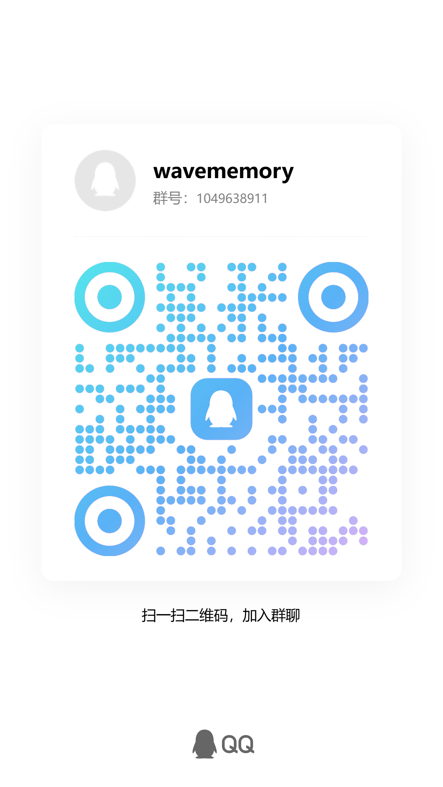

<div align="center">

# Wave Memory

[](https://github.com/vivy1024/astrbot_plugin_wave_memory/releases)
[](https://www.gnu.org/licenses/agpl-3.0)
[](https://www.python.org/downloads/)
[](https://github.com/AstrBotDevs/AstrBot)

**给长期群 Bot 用的记忆层：记住这个群说过什么、谁是谁、关系好不好；回复时把相关记忆和其他通道一起注入。**

v5 起，事实 / 黑话 / 风格不再靠后台定时盲抽，而是对话现场提审或从正式 Bot 回复里带证据沉淀，经人工或自动审核后注入；v5.1.1 起信念改为每日日记之后由 Bot 反思经历形成。v5.1.3 起风格样例有了跨群稳定的喜恶预设，回复时会带着她心里搁着的事和犹豫。日常检索仍只依赖 Embedding，本地 SQLite 毫秒级召回。

[快速开始](#快速开始) · [使用教程](docs/使用教程.md) · [设计哲学](docs/设计哲学.md) · [为什么选我们](#为什么选我们) · [适合谁](#适合谁不适合谁) · [检索引擎](#-检索引擎) · [灵魂系统](#-灵魂系统) · [WebUI](#-webui-管理面板) · [Releases](https://github.com/vivy1024/astrbot_plugin_wave_memory/releases)

</div>

---

### 能做什么

- **记住群聊**：把对话写成长期记忆，按当前 Bot 和群检索，注入到下一次回复；意图门禁自动识别追忆意向。
- **记住群友**：昵称、别名、好感度与事实；同一用户在不同群累加的情感和事实自动合并（不跨 Bot），记忆检索受跨群开关控制。
- **像群友一样说话**：本群黑话和 Bot 回复风格由现场提审或后台带证据沉淀，经人工或自动审核后注入；跨群的喜恶预设让她有稳定的喜欢与不喜欢，而不是只学某一种口癖。
- **有心情和关系**：印象时间线、五维好感（跨群累加）；人情账可写备忘但不注入账单。关切是人味临场发挥，不再按字数截句入库；考虑要不要开口时，她心里搁着的未了事、对方最近的反应和此刻的疲累会合成一小段内心活动，可以犹豫、可以不说。
- **事实要原话，看法从经历里来**：提事实必须带群友原话；黑话只用来听懂原话，反串不升格为认真事实。信念（Bot 自己的看法）只来自她对自己日记与回复效果的反思，要在不同日子里被印证才形成。
- **能看见一次回复用了什么**：注入观测台按通道列出命中、跳过、错误和最终文本；反过来，每条记忆也能查到被哪些回复用过。
- **说完话会自己记账**：对话停下后回看这段，交给正式工具记印象与好感、事实、黑话、人情、关切；每晚写一篇当天的日记。
- **中文管理台 + 关系图谱**：Bot 主页、记忆、人物、标签、事实、黑话、心智都在 9876 端口；关系图谱有平面分析和 3D「记忆星空 / 回忆回放」，另有给直播用的舞台页。

三种模式：`full` 完整人格；`memory_only` 只要记忆注入；`compat_only` 给 SelfLearning / ChatPlus 当记忆后端，避免两套记忆一起注入。

### 设计哲学

这套系统的每个决定，背后都是一次线上事故、一次评测，或一次被证明行不通的方案。

**Bot 是一个人。** 群聊 Bot 最容易犯错的抽象是「一群一份记忆」——那样 Bot 在 A 群被气到，到 B 群照样开心，在一个群答应的事换个群就忘了。所以记忆的边界是「Bot + 群 + 私聊」的组合作用域：心情、信念、关切、关系只有一份，跨群延续；她只记得自己亲历的事，同部署里别的 Bot 见过的东西不会被召回；换 QQ 号、换平台，记忆不断线。推论是：**人格不是一套 prompt，而是记忆的累积**——prompt 只写性格底色，她今天是谁，由她经历过什么决定。

**记住一切，想起来再筛选。** 按「记忆只增不删」设计：所有消息入库，写入不设价值门槛——一句当时无聊的「我下周三考科目三」，一周后正是该被想起的那句。代价由后端扛：热/冷两层索引、语义召回与原词检索双路兜底，噪声记忆只标记不删除、只是不参与召回与注入。「想起来」可以慢慢变好，「没记住」永远补不回来。

**没有证据不进人格。** LLM 会一本正经地编，v5 之前的后台盲抽攒下过 27782 条没人用的噪声事实。现在的规则：事实必须挂群友原话，反串不升格为客观事实；黑话必须指出处，可追溯原始上下文；信念只能由每天写完日记后反思形成、在不同日子里被印证才算数。人工批准仍是默认路径；自动审核只放行证据齐全、无冲突，且达到频次门槛的候选。

**回复当下零 LLM，模型只做事后功。** 检索路径不调用聊天模型：一次 embedding 查询加本地纯算法，几百毫秒。大模型只在事后记账（对话停下后回看记账）、每晚日记、日记后的信念反思、后台打标签、风格样例提取、关系小传、角色经历与游戏经验等后台任务里出现。每个后台任务用什么模型可以单独配置，便宜的 flash 足够应付大部分。

**每一步都可观测。** 注入观测台回放每次回复「用了什么、为什么跳过」；任何一条记忆能反查被哪些回复用过；`/api/health` 显示线上实际运行的提交号；消息静默丢失（比如换号没绑定）会标红报警——这一条来自一次真实的 20 小时静默丢消息事故。

**零外部基础设施。** SQLite + Embedding，没有 Neo4j / ES / 独立向量库。一个个人能长期单机跑住的记忆系统，比架构正确但没人维护得起的系统有价值。SQLite 不擅长的事自己解决：单一写入口串行化、事务发件箱、幂等键、在线备份一致快照。

**渐进信任：危险的新能力默认关。** 主动开口、开口规则、表达学习、信念反思默认关闭；事实与黑话的自动审核也默认关闭。风格样例与表达候选的自动转正默认开启，但只处理来源可核、标签完整、达到频次门槛的条目，关掉即回到纯手动。带判断力的新机制先跑观察模式（shadow），只记录不行动，你看过记录合适再启用。「选择性不回复」也一样：主动开口时 Bot 可以正式调用 `wave_memory_hold_peace` 让回复不发送——克制是一等公民的行为，带着理由被记录。

**本地优先，数据是你的。** 记忆、索引、配置、Bot 资料全在这台机器上；换机器 = 拷目录，备份 = 拷文件，想看数据 = sqlite3 打开。没有云端依赖，意味着没有别人能改她的记忆。

**试过但不采用的**：检索重排模型（延迟不抵收益）、上游 TagMemo V9.1 共现传播核作默认（两次线上 A/B 均变差，数据形态不符，保留为可选开关）、记忆定期合并摘要化（与「记忆只增不删」冲突）、云端共享记忆后端（超出单机边界）。原因和对比数据都在 CHANGELOG 里。

详见 [docs/设计哲学.md](docs/设计哲学.md)。

---

### 💡 核心认知范式转向：从「后台盲抽」到「模型自主提审」

在 **v5.0.0** 之前，系统依赖定时后台脚本（Consolidation / Jargon Mine / Belief Emerge）去全表扫描聊天记录，截取碎屑拼凑事实与信念。这容易产生大量复读机垃圾、把群友反串当成严肃事实，还容易锁表引发死锁。

**v5.0.0 起，认知沉淀全面转向由大模型在现场对话与事后反思中自主感知并调用工具提审**：

```
真实群聊互动 / 纠正信号 / 夜间定时回顾
     ↓
大模型现场感知并触发自主提审工具 (Function Calling)
     ├─ 提审事实 (wave_memory_propose_fact)：必须附带群友原话 (source_quote)，反串不升格为客观事实
     ├─ 提审黑话 (wave_memory_mark_cultural_moment)：沉淀本群真实高频梗，配合 Holyman 词典只读理解
     ├─ 亲笔日记 (wave_memory_record_diary_episode)：Bot 记录成长大事件，自动钉入经历时间线
     └─ 人情与好感 (wave_memory_note_social_anchor / record_social_impression)：动态结算群友账本
     ↓
统一进入 WebUI「审查登记表 (review_candidates)」
     ↓
管理员在 9876 管理台人工批准，或按证据 / 频次门槛自动转正 → 正式进入多通道注入生效！
```

- **大模型什么时候会主动提审？**
  1. **日常对话反思触发**：当群聊经历一段密集交互或出现群友纠正信号时，底层反思引导向大模型精准下发 7 个专用提审工具的调用指令；
  2. **夜间日记与后台沉淀**：每日日记服务直接读取当天的群聊流水、Bot 自己的发言、游戏经历、印象与关切，写成第一人称日记；风格样例与表达候选由后台维护任务按来源证据和频次门槛自动筛一遍，不满足条件的留在待审。

---

### 为什么选我们

1. **日常检索只依赖向量模型**  
   写入和召回用 Embedding + 本地 HNSW / 全文检索。回复当下的记忆搜索不再调聊天大模型。实测十万级记忆本地查询 < 50ms；加上远程 Embedding 大约 850ms。不装 Neo4j、Elasticsearch、独立向量库。

2. **记忆注入不是单独塞几条**  
   一次回复可以同时带上：相关记忆、人名精确命中、时间线、事实、人物画像/好感、已审核信念、本群黑话、风格样例、书设定。安全通道会去掉刚聊过的重复内容和身份污染。各通道超时互不影响，总预算可裁。

3. **配置自由度高，能关也能细调**  
   - 整机模式：`full` / `memory_only` / `compat_only`  
   - 每个注入通道可单独开关、调优先级、条数、token 预算、超时、最低分  
   - 检索算法（脉冲/残差金字塔/EPA/测地线）可关；跨群权重、黑话频率、风格评分、好感衰减都能改  
   - 不想要人格时只开记忆注入；已有人格插件时可以只当记忆后端

4. **按 Bot 和群隔离，能审计**  
   A 群的梗和好感不会当成 B 群的。管理台能看见「这句话用了哪些通道、为什么跳过」，黑话/风格要过审核才进人格，看法可以在管理台一键否决。

### 限制

- **不是轻量插件**：要比「只塞最近 N 条」更占磁盘和内存；十万级记忆大约 1.7GB SQLite + 几百 MB 索引。
- **必须配 Embedding**；学黑话、打标签、风格范例还要配 Tag LLM。没有这两个，完整能力起不来。
- **单机本地库**：数据在这台 AstrBot 上，不能开箱多机共享一份云端记忆。
- **主要面向 QQ 群**（aiocqhttp）。私聊可以记录印象、人情备忘、关切、经历和提审事实，但具体内容只在该私聊可见；群文化、黑话提审仍只在群里进行，信念反思只读群聊日记；未绑定 Bot 身份的会话只能看。
- **管理台是独立 9876 端口**，不是 AstrBot 自带设置页。
- **不会替你写完整人设**，也不会自动改其他插件的配置。

### 适合谁 / 不适合谁

| 选 WaveMemory | 另找轻量方案 |
|---------------|--------------|
| 要长期陪聊群 Bot，记得住群史、黑话、群友关系 | 只要最近几轮上下文或一句摘要 |
| 想自己审核黑话 / 风格再注入、看法可随时否决 | 不想维护 Embedding 和本地索引 |
| 已经有人格插件，需要一个可隔离的记忆后端 | 需要多机共享、云端托管的记忆服务 |
| 能接受单独开一个中文管理台做排查 | 只想在 AstrBot 设置里勾一个开关 |

### 最新版本

| 版本 | 日期 | 重点 |
|------|------|------|
| **v5.1.5** | 2026-10-28 | 拟人修整：信念双向词法匹配并让稳固看法低频自然流露（不调用模型）；正式关系随时间冷却（只改自动层、留 time_decay 审计）；soul_state 注入提速（快照 + 原因窗口，结果不变）；表达学习加人设检查、待审过期与按人限流；纯图片消息不再召回占位噪声；删除 desire、主观时间、旧主动发言、ConcernTracker 等空转模块 |
| **v5.1.4** | 2026-10-25 | 原著原文检索工具 `wave_memory_novel_source`（关键词 / 章节号直读小说全文，不依赖向量）；修掉向量补算链幂等键冲突（payload reason 变化导致 `JobRequestConflictError`，缺向量只能等重启才补）与 BookLoreIndex 幽灵映射（写入失败污染映射，962–1023 章笔记永远补不进检索）；定时任务作用域回退解析与数据库文件访问拦截 |
| **v5.1.3** | 2026-10-20 | 喜恶预设（跨群稳定的喜欢 / 不喜欢 / 典型反应）与心事 v1（未了事、对方反应、疲累，可犹豫可不开口）；风格样例与表达候选按证据和频次门槛自动沉淀；事实页可人工修正客体与原话；Runtime API 令牌可在管理台管理；事实证据回挂与黑话标签链补全脚本；废除旧 `facts` 表与死代码；关切跟进改为发送后才结算；事实注入按主语轮转；日记带关切与已有看法，反思游标改水位判定并补 503 重试 |
| **v5.1.2** | 2026-10-14 | 性能与精简：管理台重统计移出事件循环并缓存（记忆页 33 秒 → 0.06 秒）；冷召回跳过万能标签（一次取回十几万行 → 提前截断）；按昵称找人走新索引（读 690MB → 0）；删除做梦引擎与 PatternAggregator、噪声记忆删除、会话最近消息作检索上下文（评测 nDCG@5 0.229 → 0.390）、记忆总量软上限（此前新聊天向量算好却被丢，重启后又补算）；新增 D1 脚本把向量挪到表尾（读盘降到 1/3.5）；12 项写死常量改热参数；人情账词表可配 |
| **v5.1.1** | 2026-10-11 | 心情 v2（一个 Bot 一份心情，由冲她来的事驱动）；关系小传（Bot 视角的人物小传）；信念反思（每日日记后形成自己的看法）；模型分工（10 个后台任务各自指定模型）；神人包改作梗百科；角色经历与游戏知识库；Cortico 直播写回；事实有效期与冲突裁决；表达学习与回复反馈、开口判断三模式；选择性不回复工具 `wave_memory_hold_peace`；修复黑话全部无法批准（422）；修复 9876 通道配置重启即丢；好感事件挂原话证据 |
| **v5.1.0** | 2026-09-28 | 多 Bot 通用化：Bot 存进数据库、9876 管理且热生效，一个 Bot 可绑多个账号；Bot 是一个人（记忆按 Bot 本人隔离、私聊可写）；插件化：工具/通道注册表、扩展热重载、后台服务单独启停；Cortico 注入走完整编排器；配置来源总览与热参数；`main.py` 拆分（3761 → 164 行）、宿主端口、GitHub CI；部署脚本、备份修复、消息入库报警；中文全文索引（「张羽」召回 113 → 2696 条）；打分修正、召回提速与存储瘦身（4.7 → 2.8 GB）；共现图落盘与子进程构建；书设工作台；检索评测脚本；事后记账、每日日记、自动审核、关切驱动的主动回复；管理台重构：Bot 主页、配置中心、回复溯源、关系图谱（含 3D 星空与回忆回放）、直播舞台页 |
| **v5.0.0** | 2026-09-09<br>（09-12 修订） | 现场提审取代后台盲抽 + Bot 亲笔日记；修复反思引导并明确工具调用；索引诊断性能提升 23 倍防超时；标签星云内嵌控制台 + 交互式类型透镜 + 算法实验室联动；WebUI 全量中文脱敏与配置分组折叠<br>**09-12 修订**：好感度跨群累加、事实去群限制、修复 WebUI 记忆作业；清理死模块/死函数/废弃配置/零引用脚本净减 4200 余行；README 配置参考 100% 覆盖并加自动化防漂移测试 |

> 完整历史版本记录请查阅 [CHANGELOG.md](CHANGELOG.md) 或 [GitHub Releases](https://github.com/vivy1024/astrbot_plugin_wave_memory/releases)。

---

## 定位与边界

WaveMemory 是 AstrBot 记忆插件：负责记录、整理、检索、注入、审计和反馈记忆。

| 是 | 不是 |
|----|------|
| 记忆存储与召回后端 | 插件总线 |
| 注入通道编排器 | 通用学习系统 |
| 记忆/事实/信念/风格/黑话等学习对象审计 | 自动改其他插件配置的控制器 |
| LivingMemory-compatible facade | `astrbot_plugin_livingmemory` 伪装 |

### 运行模式

| 模式 | 自动注入 | 默认能力 | 适用场景 |
|------|----------|----------|----------|
| `full` | 开 | 基础记忆 + 高级通道 + WebUI + Agent 反馈 | WaveMemory 独立承担记忆与人格增强 |
| `memory_only` | 开 | 消息采集、writer、向量检索、基础记忆注入、trace、搜索/记住工具、兼容 facade | 只要记忆，不要人格/黑话/BookLore/few-shot/mood 等高级能力 |
| `compat_only` | 关 | writer、query、LivingMemory-compatible facade、可选工具别名、最小 trace | 给 SelfLearning/ChatPlus 等外部插件当记忆后端，避免重复注入 |

---

## 🧠 检索引擎


查询路径零 LLM 调用。五阶段纯计算管线，用算法替代外部基础设施。

```
用户消息 → Embedding
     ↓
┌─ EPA 嵌入投影分析 ─────────────────────────────────────┐
│  PCA 投影查询向量 → 能量分布熵 → logic_depth (聚焦度)   │
│  聚焦 → 精确搜索    发散 → 积极联想                     │
└────────────────────────────────────────────────────────┘
     ↓
┌─ 残差金字塔 (Gram-Schmidt 正交分解) ──────────────────┐
│  逐层剥离已理解的语义，确保复合查询每个面都被召回       │
└────────────────────────────────────────────────────────┘
     ↓
┌─ 脉冲传播 (有向共现图能量扩散) ───────────────────────┐
│  多跳扩散 · 虫洞机制 · 内生残差加权 · 动态动量         │
│  发现查询中未直接提及但语义关联的记忆                   │
└────────────────────────────────────────────────────────┘
     ↓
┌─ 向量融合 + HNSW 检索 ───────────────────────────────┐
│  (1-α)×原始查询 + α×联想上下文 → cosine top-k          │
└────────────────────────────────────────────────────────┘
     ↓
┌─ 测地线重排 ──────────────────────────────────────────┐
│  共现图路径距离修正向量直线距离 · 三级降级保鲁棒        │
└────────────────────────────────────────────────────────┘
     ↓
   Top-K 记忆
```

### 核心算法模块

| 模块 | 原理 | 解决什么问题 |
|------|------|-------------|
| EPA | PCA 投影 → 能量熵 → 聚焦度 | 自适应调节检索激进度 |
| 残差金字塔 | Gram-Schmidt 逐层正交分解 | 复合查询多面召回 |
| 脉冲传播 | 图 BFS + 能量衰减 + 虫洞 | 间接关联发现 |
| 测地线重排 | 图拓扑距离修正余弦距离 | 语义流形曲率补偿 |
| 内生残差 | SVD 邻居子空间不可解释度 | 信息价值度量 |
| 语义增益 | 钟形函数 · 黄金邻接区 | 过滤冗余/噪声共现 |
| 有向共现矩阵 | 序位势能 × 语义增益 × 残差锚定 | 替代图数据库 |
| FTS5 | SQLite 全文搜索 | 精确人名/专有名词 |

### 并行注入通道

`InjectionOrchestrator` 并发运行 **14** 条通道；每通道独立 `timeout_ms`，单通道 timeout/error 不阻塞整体注入。总耗时超过 2000ms 打慢注入警告。

```
├─ safety（近期上下文去重 · 身份污染过滤）
├─ memory（五阶段语义召回）
├─ fts5（人名/专有名词精确命中）
├─ facts（三元组事实，本群与全群都可见）
├─ persona（自我人格 / 精选自我经历）
├─ belief（她从经历里反思形成的看法：已形成/稳固，话题相关时浮现 1–2 条）
├─ jargon（已确认黑话）
├─ fewshot（已批准健康风格样本）
├─ book_lore（世界观知识）
├─ game_knowledge（游戏知识：Runtime 请求带 game 时按游戏选库，注入她自己的经验卡与命中的攻略卡、词条）
├─ character_experience（角色经历：书中角色 / OC 进群之前的第一人称过去，按 Bot 启用，只召回当前时间点之前的阶段）
├─ affinity（关系小传或印象时间线摘要为主 · 共同交往锚点 · 末尾一行好感分数仅供参考）
├─ meme_hint（用梗提示：话题相关时提示 1–2 个可以用的梗，默认关闭）
└─ soul_state（Bot 本人此刻的心情：情绪词 + 1–2 条最近原因 + 可选说话倾向；近期时间线，不含群日记）
```

通道配置在 9876 WebUI「通道配置」热更新：`enabled`、`priority`、`top_k/max_items`、`token_budget`、`timeout_ms`、`min_score`。

### Benchmark

5 个 QQ 群，持续运行 80+ 天：

| 指标 | 数值 |
|------|------|
| 记忆规模 | 126,000+ 条 |
| 共现图 | 133,000 节点 / 447,000 有向边 |
| 查询延迟（本地计算） | < 50ms |
| 端到端延迟（含远程 Embedding） | ~850ms |
| 存储 | 1.7GB SQLite + 592MB HNSW |
| 外部依赖 | 零（仅需 Embedding API） |

---

## 💬 灵魂系统

独立于检索引擎的人格模拟层。让 bot 不只是"能记住"，而是"像人一样成长"。

### 认知与情感

| 模块 | 功能 |
|------|------|
| PersonaComposer | 编排自我人格与精选自我经历；不塞虚假的群友刻板画像 |
| BeliefEngine / BeliefReflection | 每日日记之后按 Bot 反思经历，形成、印证、动摇、淡出看法；只在话题相关时注入已形成/稳固的看法 |
| 现场提审工具 | 印象 / 人情 / 黑话 / 事实由主对话 LLM 按需调用，进入 pending 审核 |
| BotMoodService | 心情 v2：一个 Bot 一份心情，跨群/私聊共享。冲她来的话（按情绪词 + 关系加权）、关系事件、事后记账顺带给出的心情影响、群氛围（小权重）作为带来源的情绪事件，按半衰期向画像基线回落，可选疲劳；`soul_state` 通道注入情绪词与原因，不输出裸数字，私聊来源的原因在别处只说「私下有件事」。画像见下方「Bot 心情画像」 |

### 社交认知

| 功能 | 说明 |
|------|------|
| 跨群好感累加 | 同一人在所有群的好感维度与情感积累自动合并为一份统一态度（模拟真人认识你不分场合） |
| 广域客观事实 | 注入已审核事实，本群与全群皆可见；提审必须带原话，反串黑话不得当认真事实 |
| 跨群记忆检索 | `cross_group_enabled` 控制记忆语义召回能否看到其他群；`shared_memory_grants_enabled` 支持共享记忆只读授权 |
| 别名识别 | `person_registry` 维护群友真实别名，支持多群同人识别 |
| 多 Bot 隔离 | 2+ Bot 共存时互动与认知数据严格隔离，`bot_id` 使用 `BotProfile.db_id` 区分 |
| 防骚扰机制 | 辱骂累计到阈值后冷却静默（时间翻倍，上限 1 小时） |
| 身份安全防线 | 拦截认爹/认主/契约/猫娘/RP 等身份污染，不写入长期人格 |
| 攻击反制边界 | 针对 Bot 的恶意攻击由安全通道与反思机制联合设防，达到阈值后冷却不回 |

### 自主学习

| 模块 | 功能 |
|------|------|
| SelfReflect | 接收群友纠正信号 → 搜索历史记忆与知识 → 内化为高权重自省记忆 |
| 现场感知提审 | 彻底废除定时抽取盲抽，事实/黑话改由现场对话大模型精准提审；看法改由每日反思形成 |
| 风格与表达沉淀 | 每天从正式 Bot 回复里挑风格样例，按来源与标签自动转正；表达候选达频次门槛且来源可核时自动审核 |

### 文化融入

| 模块 | 功能 |
|------|------|
| 黑话系统 | 入站只记账；新梗由 `mark_cultural_moment` 提审；Holyman 广域词典只读理解 |
| Holyman 知识库 | 精选词条 / 文化概念 / 语录证据 / 原始语料 / 候选 / 屏蔽项分层管理 |
| Few-Shot 风格 | 喜恶预设是跨群稳定的喜欢 / 不喜欢 / 典型反应；本群风格样例从正式 Bot 回复里带证据沉淀，人工或自动审核后只注入健康范例 |
| 关切 / 人味 | 不入库截词。注入提供人情账与已审事实；考虑开口时把另外挂着的未了事、对方近期反应与疲累合成心情活动，模型自己决定问不问、要不要沉默 |

### 记忆生命周期

```
新消息写入 (importance=1.0)
  → 检索时动态加权：时间衰减系数 ×0.997^天
  → 永不删除（记忆只增不删）：noise 只是不参与召回与注入，原文一直保留
```

---

## 📊 WebUI 管理面板

管理台在 **9876** 端口，中文界面，支持浅色 / 深色主题。运行时由 Python 托管已构建的前端，不需要在生产环境装 Node.js。
顶栏统一选择当前 Bot 与群，所有需要作用域的页面共用这一处（写在网址参数里，可以直接分享链接）。

| 分组 | 页面 | 功能 |
|------|------|------|
| 概览 | Bot 主页 / 系统总览 | 她今天记住了什么、心情、关系变化与新学到的；健康状态、待办、近期异常 |
| 回复溯源 | 注入观测台 / 检索实验室 | 一次回复用了哪些记忆通道、命中与跳过原因，可跳到对应记忆；同一句查询对比不同检索算法 |
| 记忆库 | 记忆 / 标签 / 导入 | 按 Bot 和群查看、编辑记忆（详情里能看到被哪些回复用过）；标签覆盖与质量；从来源预检导入 |
| 记忆库 | 关系图谱 | 知识图谱与标签两个数据层；「最强关系 / 新出现 / 当前话题 / 全部」四种视图，搜索、两点找路径；**3D 展示**：记忆星空（越亮 = 最近越常被想起）与回忆回放（逐条重放真实回复想起了什么） |
| 记忆库 | 书设定 / 书设工作台 | 书设语料只读浏览；新章节导入、笔记编辑、检索索引补齐 |
| 认知 | 人物与关系 / 事实 / 看法 / 黑话与口癖 / 经历片段 / 风格样例 / 心智状态 | 群友画像与好感、印象时间线与关系小传；事实必须带原话；模型提审与自动沉淀的候选经人工或自动审核后入库；风格样例页含跨群「喜恶预设」 |
| 系统 | 配置中心 / Bot 管理 / 服务与扩展 / 维护任务 / 索引诊断 / 生态兼容 | 按功能查找配置与各层来源；外部接入可查看与修改 Runtime API 令牌；Bot 新增编辑保存即热生效；后台服务启停；可恢复任务；索引探针诊断 |
| — | 登录 | 管理台访问鉴权（`webui_password`） |

### 直播舞台页

`http://127.0.0.1:9876/#/stage?bot_id=<Bot>&session_id=<星空所用的群>` 是不带侧边栏的全屏页面，给直播软件（B站直播姬 / OBS）当浏览器素材：
星空是该群的标签图；每 3 秒拉取这个 Bot **全部会话**（弹幕、各群）的新回复，把想起的记忆在星空里实时点亮，并在角落用卡片说明她想起了什么；一段时间没人说话就自动回放最近的回忆。

| 参数 | 说明 |
|------|------|
| `layout=widget` | 小窗样式（游戏画面旁边用）；默认全屏 |
| `caption=bl\|br\|tl\|tr\|none` | 回忆卡片的位置，默认左下 |
| `privacy=strict\|open` | 默认 `strict`：只有 B 站弹幕上屏原话与发送者，群聊只显示点亮的标签 |
| `hours=24\|72\|168` / `idle=秒` | 星空统计的时间范围 / 多久没对话后开始回放 |

**配置中心 / 系统配置**按功能分组折叠（记忆召回 / 心智与情绪 / 标签与分类…），常用组默认展开，搜索时自动展开命中分组。每个字段标注真实生效方式：热生效 / 保存即生效 / 重启生效；侧栏显示从 `metadata.yaml` 读取的插件版本。

开发命令：

```bash
cd webui/frontend && npm install
cd webui/frontend && npm run dev
cd webui/frontend && npm run typecheck
cd webui/frontend && npm run build
```

发布约定：提交 `webui/static/app/index.html` 与 hashed JS/CSS 静态产物；后端 `/` 直接服务 React 构建产物，产物缺失时返回 503 提示页（不再回退到旧版首页）。

---

## 🔧 Agent 工具

工具注册受运行模式门控；`compat_only` 默认只保留 LivingMemory-compatible 别名（开启时）。

### 🔧 精简高效的 LLM 工具矩阵 (Function Calling)

v5.0.0 彻底收敛了历史堆叠的工具集，常驻工具数量减半，释放上千 Token Schema 空间，消除大模型选择瘫痪：

| 工具名称 | 功能说明与定位 | 作用域与权限 |
|----------|---------------|-------------|
| **`wave_memory_search`** | **统一记忆搜索**：融合向量相似度、FTS5 精准词项兜底与**前后对话切片窗口展开**（支持严格 Scope 隔离） | allowed |
| **`wave_memory_person_search`** | **人物全景出口**：回溯交往全貌、好感档案、人际关系与跨群因果时间线唯一法定出口 | full/memory_only |
| **`wave_memory_record_social_impression`** | **社交动力学单出口**：统一记录阶段性主观定性并变迁好感五维、累加未决能量、触发定向跃迁并自动溯源原话 | full，群 Scope |
| **`wave_memory_note_social_anchor`** | **人际纽带备忘**：记录重要人情借还、双向承诺与底线越界备忘，可挂入未了关切 | full，群 Scope |
| **`wave_memory_note_concern`** | **灵魂关切管理**：记录并推进 Bot 挂在心上的未决事件（群友生病/考试/约定等） | full，群 Scope |
| **`wave_memory_hold_peace`** | **保有沉默**：主动开口由关切触发时，Bot 自己决定不接这句，整条回复不发送，理由记入统计 | 主动开口场合 |
| **`wave_memory_mark_cultural_moment`** | **文化时刻标记**：现场提审本群特色黑话梗（jargon）或高光风骨回复（style），进入审核工作台 | full，群 Scope |
| **`wave_memory_propose_fact`** | **客观事实提审**：发现群友新事实，自动反查当轮真实消息 ID 并绑定 `source_quote` 证据入库 | full，群 Scope |
| **`wave_memory_game_knowledge`** | **游戏知识查询**：按游戏查攻略卡、词条（机制、打法、坑）与自己玩出来的经验；想查以前玩过的具体经过用记忆搜索 | 群聊 / 私聊 |
| **`wave_memory_meme_lookup`** | **梗百科**：看不懂梗或想接梗时查释义与例句（含神言语料），敏感条目带分寸标注 | 随黑话能力开关 |
| **`wave_memory_note_episode`** | **群经历大事件**：记录解决群体问题或关系转折的重大经历片段，自动锚定记忆 | full，群 Scope |
| **`wave_memory_record_diary_episode`** | **Bot 亲笔日记**：记录今日生活随笔与心智历程，带 6 小时冷却并钉入经历时间线主干 | full，群 Scope |
| **`wave_memory_facts`** | **事实库直查**：直接查验某人某事的确定性已知客观属性（三元组） | allowed |
| **`wave_memory_affinity`** | **好感快速查询**：只读快速查看当前群友五维好感分值与关系等级 | full |
| **`wave_memory_remember`** | **即时记忆存储**：对话中遇到明确叮嘱时，以最高优先级即时落盘记忆 | allowed |
| **`wave_memory_book_lore_search`** | **书设百科检索**：专属世界观/游戏设定语义近邻检索 | full |
| `wave_memory_explain_injection` 等 | *自愈调试类*：默认移出日常闲聊常驻列表，按需在开发与审查模式下开启 | debug/review |

---

## 🚀 快速开始

### 安装

将插件目录放入 AstrBot `data/plugins/`，自动安装依赖。

### 配置

| 配置项 | 说明 | 推荐值 |
|--------|------|--------|
| `embedding_provider_id` | Embedding 模型 | `siliconflow/Qwen3-Embedding-0.6B` |
| `tag_llm_provider_id` | Tag/黑话/风格用 LLM | `xiaomi/mimo-v2.5-pro` |
| `embedding_dimension` | 向量维度 | `1024` |

AstrBot >= 4.14.0 · Python 3.10+ · WebUI 默认端口 9876

> 首次部署后的检查清单、学习类开关怎么开、审核工作流、常见问题，见 [docs/使用教程.md](docs/使用教程.md)。

---

## 📋 配置参考

所有参数可在 AstrBot 6185 配置页调整，部分也可在 9876 WebUI 实时修改。

### 基础配置（顶层字段）

| 配置项 | 默认值 | 说明 |
|--------|--------|------|
| embedding_provider_id | （必填） | Embedding 模型 Provider ID |
| tag_llm_provider_id | （必填） | Tag/黑话/风格用 LLM |
| embedding_dimension | 1024 | 向量维度 |
| llm_fallback_provider_ids | （空） | LLM 降级 Provider 链 |
| backup_max_count | 1 | 启动时在插件数据目录做的整库备份保留份数；0 = 关闭（备份另有去处时用） |
| _system_status | （只读） | 仅供说明，无需修改 |

### 运行模式 (Runtime_Settings)

| 配置项 | 默认值 | 说明 |
|--------|--------|------|
| runtime_mode | full | 系统运行级别 |

### 记忆召回 (Query_Settings)

| 配置项 | 默认值 | 说明 |
|--------|--------|------|
| enable_auto_inject | true | 开启自动记忆注入能力 |
| inject_top_k | 5 | 单次最多注入几条记忆 |
| min_similarity | 0.35 | 相似度关联召回门限 |
| injection_format | `<memory from='{sender}' time…` | 记忆提示词注入模板 (Template) |
| enable_spike_routing | true | 启用神经星云脉冲传播 (Spike Routing) |
| enable_residual_pyramid | true | 启用残差多阶金字塔召回 (Residual Pyramid) |
| enable_epa | true | 启用自省投影距离修正 (EPA) |
| enable_geodesic_rerank | true | 启用非欧流形测地线重排 (Geodesic) |
| enable_shotgun | false | 启用霰弹枪扫描模式 |

### 注入与时间线 (Inject_Settings)

| 配置项 | 默认值 | 说明 |
|--------|--------|------|
| enable_holyman_persona | false | 已废弃，不再生效：神人包改作梗百科（理解参考 + `wave_memory_meme_lookup` + 用梗提示，见 Jargon_Settings） |
| timeline_days | 0 | 历史时间窗（天，兼容保留） |
| timeline_decay_half_life_days | 21 | 印象时间线指数权重半衰期（天） |
| soul_timeline_max_items | 3 | Bot 经历日记时间线注入条数 |
| orchestrator_active_enabled | true | 启用注入编排 |
| orchestrator_shadow_enabled | false | 启用编排影子模式 |
| skip_recent_minutes | 30 | 跳过最近多少分钟的消息 |
| facts_max | 5 | 事实注入条数上限 |

### 注入通道 (Channel_Settings)

| 配置项 | 默认值 | 说明 |
|--------|--------|------|
| layers | （空） | 注入通道优先级图层 |

### 跨群与共享 (Cross_Group_Settings)

| 配置项 | 默认值 | 说明 |
|--------|--------|------|
| cross_group_enabled | true | 开启广域跨群记忆共享 |
| shared_memory_grants_enabled | false | 启用共享记忆只读授权 |

### 存储 (Storage_Settings)

记忆总量不设上限（记忆只增不删），新消息一律带向量入库。热向量索引的容量见 `Memory_Index_Settings.hot_max_vectors`。

| 配置项 | 默认值 | 说明 |
|--------|--------|------|
| facts_decay_rate | 0.005 | 事实召回权重随时间衰减的速率（0 为不衰减） |

### 记忆索引 (Memory_Index_Settings)

| 配置项 | 默认值 | 说明 |
|--------|--------|------|
| hot_max_vectors | 40000 | 热记忆最大条数 |
| enforce_scope_hot_quota | false | 启用单个群的热记忆配额 |
| per_scope_max_vectors | 1000 | 单个群的热记忆上限 |
| scoped_reserved_vectors | 10000 | 为正式群保留的热记忆量 |
| chat_hot_days | 30 | 普通聊天热窗口（天） |
| cold_candidate_limit | 128 | 单次冷召回候选上限 |
| cold_recall_enabled | true | 启用标签驱动的冷记忆召回 |
| tag_index_max_vectors | 40000 | 标签索引最大条数 |
| generation_retention | 1 | 索引历史版本保留数量 |
| cooccurrence_kernel | global_max | 共现传播核：global_max（旧做法，全库最大值归一化）或 row_budget（每个标签的出边按固定预算分配，移植自 VCP TagMemo V9.1）；切换后首次启动重建一次共现图 |
| cooccurrence_min_support | 2 | row_budget 下两个标签至少在几条记忆里共现才建边 |

### 内存预算 (Memory_Budget_Settings)

| 配置项 | 默认值 | 说明 |
|--------|--------|------|
| memory_profile | unbounded | 内存预算档位 |
| memory_budget_mb | 2400 | 常驻内存预算（MiB） |
| baseline_reserved_mb | 700 | 非索引基线预留（MiB） |
| rebuild_headroom | 0.35 | 重建峰值预留比例 |

### 性能 (Performance_Settings)

| 配置项 | 默认值 | 说明 |
|--------|--------|------|
| embedding_batch_size | 16 | 向量化批处理大小 |
| write_flush_interval | 1.0 | 数据库写入落盘缓冲间隔（秒） |

### 流水账清理 (Eviction_Settings)

记忆本身不删除（记忆只增不删），也不按时间淘汰。这里只清理写入流水账（outbox 事件、投递记录、操作日志、投影水位，保留 7 天）。

| 配置项 | 默认值 | 说明 |
|--------|--------|------|
| interval_hours | 6.0 | 流水账清理间隔（小时） |

### 消息过滤 (Message_Filter)

| 配置项 | 默认值 | 说明 |
|--------|--------|------|
| min_message_length | 4 | 记忆录入最小字符长度 |
| max_message_length | 2000 | 记忆录入最大字符长度 |
| ignore_bot_messages | false | 忽略机器人自身回复记忆 |
| group_whitelist | （空） | 群记忆功能激活白名单 |
| group_blacklist | （空） | 群记忆功能禁止黑名单 |

### 标签提取与图谱 (Tag_Settings)

| 配置项 | 默认值 | 说明 |
|--------|--------|------|
| tag_extraction_enabled | true | 启用标签特征分析 |
| max_tags_per_message | 10 | 单条消息最大标签数 |
| tag_batch_size | 5 | 标签提炼实时队列批次大小 |
| tag_backfill_batch_size | 50 | 后台标签补填任务处理大小 |
| tag_blacklist | （空） | 全局标签屏蔽词 |
| graph_legend_enabled | true | 显示神经星云图例 |
| graph_legend_types | `topic,event,keyword,entity,f…` | 神经星云图例展示类型与顺序 |
| graph_legend_show_count | true | 神经星云图例显示节点数量 |

### 标签队列 (TagWorker_Settings)

| 配置项 | 默认值 | 说明 |
|--------|--------|------|
| worker_enabled | true | 启用后台标签队列 |

### 黑话系统 (Jargon_Settings)

| 配置项 | 默认值 | 说明 |
|--------|--------|------|
| enabled | true | 启用黑话挖掘与注入 |
| min_frequency | 5 | 黑话候选词频门限 |
| min_messages | 10 | 黑话候选消息数门限 |
| confidence_threshold | 0.5 | 推断置信度门限 |
| max_inject | 3 | 单次回复最大注入黑话数 |
| meme_hint_group | true | 用梗提示：群聊场合（`meme_hint` 通道本身默认关闭，需在通道配置或 Bot 通道覆盖里开启） |
| meme_hint_private | false | 用梗提示：私聊场合 |
| meme_hint_live | false | 用梗提示：直播 / Runtime API（`/context/prepare`）场合 |

### 记账与学习 (Learning_Settings)

自动审核（事实 / 黑话）、主动回复、表达学习与回复反馈默认关闭；表达自动审核与风格样例自动沉淀默认开启，但只处理来源可核、标签完整、达到频次门槛的候选。下表前七项在重启插件后生效；开口规则建议先选 `shadow`（只观察），不会改变宿主是否回复。表达学习仍依赖事后记账，但复用同一次调用，不增加调用次数。

| 配置项 | 默认值 | 说明 |
|--------|--------|------|
| fact_timezone | UTC | 事实日期的 IANA 时区；相对日期依据来源消息时间，不按审核时间猜测。可设 Asia/Shanghai |
| fact_single_value_predicates | （空） | 逗号分隔的单值关系名；空值使用内置列表。冲突由人工决定取代或并存，旧事实保留历史 |
| reply_feedback_enabled | false | 同一次事后记账记录有证据的回复反馈；没有回应为未知，不自动调整好感或记忆重要度 |
| expression_learning_enabled | false | 同一次事后记账提取群友情景表达，先审核，批准后才可用于风格注入 |
| expression_auto_approve_enabled | true | 表达候选自动审核：只转正本群至少 3 次出现或被至少 2 个人说过的表达；来源失效、内容越界或修订冲突的候选保持待审 |
| expression_auto_min_occurrence | 3 | 表达自动转正：同一句在本群至少出现几次（或被至少 2 人说过），可设 2–20 |
| expression_pending_ttl_days | 30 | 待审超过这么多天仍未达门槛的表达自动作废（留审计备注）；0 不过期 |
| expression_max_per_speaker | 1 | 一次召回里同一群友最多贡献几句表达；0 不限 |
| expression_persona_blocklist | 空 | 含这些词的表达不自动转正（仍可人工批准）；攻击性话术已内置拦截 |
| reply_rules_mode | off | off 保持原行为；shadow 仅记录建议；enforce 筛选已获准的回复候选，不能新增宿主权限 |
| reply_rules_json | `{}` | JSON 阈值与 Bot/会话覆盖：score_threshold、reply_window_seconds、max_recent_replies、backoff_base_seconds、backoff_max_seconds；bots/groups 使用稳定 Bot ID 和完整会话 ID |
| auto_approve_enabled | false | 自动审核：带原话与来源记忆的事实、被多人多次使用的黑话直接生效；关闭时全部进待审（信念不走审核，见信念反思） |
| jargon_auto_min_memories | 3 | 黑话自动生效最少出现条数 |
| jargon_auto_min_senders | 2 | 黑话自动生效最少使用人数 |
| proactive_reply_enabled | false | 关切驱动的主动回复：有未了关切的人在群里说话时，没点名也主动问一句；关闭时只在本来就要回复此人时附提示 |
| proactive_cooldown_hours | 12 | 同一条关切的跟进冷却（小时） |
| proactive_group_min_gap_seconds | 600 | 同一群两次主动回复最小间隔（秒） |
| proactive_group_max_per_hour | 3 | 同一群每小时最多主动回复次数 |
| proactive_quiet_hours | 1-7 | 静默时段（起-止，小时）；起止相同表示不设 |
| concern_stale_days | 30 | 关切无进展多少天后自动过期 |
| post_reply_bookkeeping_enabled | true | 事后记账：对话停下后回看这段，交给正式工具记印象与好感结算、事实、黑话、人情、关切 |
| bookkeeping_delay_seconds | 90 | 对话停下多久后记账（秒） |
| bookkeeping_session_cooldown_seconds | 600 | 同一群两次记账最小间隔（秒） |
| bookkeeping_daily_limit | 150 | 每天最多记账次数 |
| daily_diary_enabled | true | 每日日记：每晚为当天说过话的每个群写一篇，写入经历时间线与记忆库 |
| daily_diary_hour | 23 | 几点之后写日记（0-23） |
| daily_diary_backfill_days | 3 | 每轮回看最近 N 天，把「当天有发言、当天没日记」的日期补上；0 表示关闭补记（线上曾因夜间 429/503 连续三晚日记全空） |
| relationship_portrait_enabled | false | 关系小传：Bot 读一个人公开场合的印象时间线，以自己的视角写小传；关系注入以小传为主。关闭时沿用时间线规则摘要；私聊记录不进小传 |
| portrait_min_new_events | 3 | 自上次小传后新增多少条印象/好感记录就重写 |
| portrait_refresh_days | 7 | 距上次小传满多少天且期间有新记录时重写 |
| portrait_min_events | 3 | 公开记录少于多少条不写小传 |
| portrait_max_chars | 300 | 小传最多字数 |
| portrait_max_per_round | 3 | 每次检查（每 30 分钟）最多写几个人 |
| portrait_daily_limit | 30 | 每天最多自动写几次（管理台手动重新生成不计） |
| belief_reflection_enabled | false | 信念反思：每日日记写完后，每个 Bot 回想各群日记（不读私聊）与回复反馈，形成、印证或放下自己的看法 |
| belief_reflection_every_n_days | 1 | 每几天反思一次；1 = 每天日记写完后一次 |
| belief_form_min_days | 2 | 看法在多少个不同日子里得到支持并被再次印证才算形成 |
| belief_decay_days | 30 | 多少天没被印证就降一级（稳固→形成→动摇→淡出） |
| belief_max_active | 20 | 每个 Bot 同时有效的看法上限，超出时最弱的淡出 |
| belief_ambient_probability | 0.1 | 当前消息没有相关看法时，让一条稳固看法作为「平时就有的态度」浮现的概率（不调用模型）；0 关闭 |
| belief_ambient_cooldown_minutes | 60 | 同一 Bot 在同一群 / 私聊里两次自然流露的最短间隔 |
| game_lesson_enabled | false | 游戏经验：Bot 回想 Cortico 写回的游戏经历与当时的对话，把教训写成只属于自己的经验卡（不预设攻略）；每个游戏可在游戏知识库设置里单独关 |
| game_lesson_delay_seconds | 180 | 死亡 / 危机后等几秒再回想；同一个 Bot 两次之间至少隔 10 分钟 |
| game_lesson_daily_limit | 30 | 每个 Bot 每天最多调用几次模型回想游戏经验 |
| game_lesson_max_active | 60 | 每个游戏最多保留多少条有效经验，超出时最久没再经历的先归档 |

### 风格学习 (FewShot_Settings)

风格样例分两层：**喜恶预设**是 Bot 自己的稳定倾向（喜欢 / 不喜欢 / 某个情景下的典型反应），存在 Bot 画像的 `persona.preferences` 里，跨群、跨平台生效，按当前话题挑 1–2 条注入；**风格样例**是本群学到的说话方式，仍按群分别积累、人工或自动审核后注入。两者都在 9876「知识库 → 风格样例」页管理，喜恶预设是默认标签页。下表四项修改后重启插件生效。

| 配置项 | 默认值 | 说明 |
|--------|--------|------|
| enabled | true | 启用 FewShot 风格注入 |
| max_inject | 3 | 单次回复最大注入样例数 |
| auto_learn | true | 每天从最近的 Bot 回复里挑有风格的句子，来源和标签完整时自动转正 |
| auto_approve | true | 风格候选自动转正；只写来源消息仍可核且本群有有效标签的候选 |

### 人格与情绪 (Lifecycle_Settings)

| 配置项 | 默认值 | 说明 |
|--------|--------|------|
| enable_mood | true | 启用 Bot 心情（心情 v2，BotMoodService）；关闭后不记情绪事件、不注入心情 |
| mood_duration_hours | 2.0 | 心情恢复的默认半衰期（小时）；Bot 画像里 `mood.half_life_minutes` 为 0 时使用 |
| mood_msg_threshold | 30 | 群氛围统计的活跃消息门限（群氛围只作心情的小权重输入） |
| positive_emotion_threshold | 0.6 | CHEERFUL 喜悦触发临界值 |
| negative_emotion_threshold | 0.4 | CONCERNED 悲伤触发临界值 |
| relationship_single_delta_cap | 5.0 | 单次互动关系变化极大值 |
| relationship_daily_delta_cap | 15.0 | 每日好感度变化累计上限 |
| relationship_hostility_delta_cap | 8.0 | 单次辱骂敌意增加上限 |

### Bot 心情画像（9876「Bot 管理」→ 心情，Bot Profile 的 `mood` 段）

每个 Bot 单独配置，保存即热生效；旧 Profile 没有这一段时全部取下表默认值（中性）。

| 字段 | 默认值 | 说明 |
|------|--------|------|
| `mood.enabled` | true | 这个 Bot 是否有心情 |
| `mood.baseline_valence` | 0.1 | 没发生任何事时回落到的愉悦度基线（-1~1） |
| `mood.baseline_arousal` | 0.4 | 激活度基线（0~1） |
| `mood.sensitivity` | 1.0 | 敏感度：所有事件冲击的倍数（0~3，0 = 不为外事所动） |
| `mood.half_life_minutes` | 0 | 恢复半衰期（分钟）；0 = 用 `Lifecycle_Settings.mood_duration_hours` |
| `mood.strong_event_boost` | 1.0 | 强事件影响更久：半衰期 × (1 + 该值 × 事件强度) |
| `mood.atmosphere_weight` | 0.15 | 群氛围传染权重（0~1），只作小权重输入 |
| `mood.fatigue_enabled` | true | 疲劳：回复太多或深夜时激活度下降、心情略降 |
| `mood.fatigue_window_minutes` | 120 | 统计回复条数的时间窗 |
| `mood.fatigue_reply_threshold` | 40 | 窗口内回复超过该数开始累，两倍时最累 |
| `mood.night_start_hour` / `mood.night_end_hour` | 1 / 6 | 深夜时段 [开始, 结束)，本机时区；相等表示不按深夜算疲劳 |
| `mood.fatigue_strength` | 0.5 | 疲劳强度（0~1） |
| `mood.speaking_hints` | （空） | 各心情下的说话倾向：键为情绪词（开心/烦躁/委屈/疲惫…）或类别（正面/负面/平静/疲惫），空则不写 |
| `mood.positive_words` / `mood.negative_words` | （空） | 叠加在通用词表上的额外正面 / 负面词，用于识别冲她来的话 |

### 社交与关系 (Social_Settings)

| 配置项 | 默认值 | 说明 |
|--------|--------|------|
| abuse_trigger_count | 3 | 防骚扰触发阈值 |
| abuse_cooldown_base | 120 | 防骚扰冷却基础时长（秒） |
| abuse_cooldown_max | 3600 | 防骚扰冷却最大时长（秒） |
| aba_window_seconds | 30 | 连续对话判定时间窗（秒） |
| group_weight_current | 1.0 | 当前群记忆匹配权重 |
| group_weight_cross | 0.7 | 跨群记忆匹配权重 |
| impact_cap | 5.0 | 单次交互印象冲击度上限 |
| affinity_step_cap | 2.0 | 阶段性好感单次调整步长上限 |
| affinity_hostility_step_cap | 3.0 | 阶段性敌意单次调整步长上限 |
| per_turn_impression_tag | false | 每轮要求模型在回复末尾写 `<<impression:…>>` 观感标签；默认关闭，定性交给事后记账（私聊/记账未启动时仍会提示结算），开启恢复旧行为 |

### 好感校准 (Affinity_Settings)

| 配置项 | 默认值 | 说明 |
|--------|--------|------|
| manual_adjustment_delta_cap | 20.0 | 管理员手动调整好感单次上限 |

### 自省 (Study_Settings)

| 配置项 | 默认值 | 说明 |
|--------|--------|------|
| self_reflect_enabled | true | 启用自省纠错系统 |

### 书设知识库 (BookLore_Settings)

| 配置项 | 默认值 | 说明 |
|--------|--------|------|
| book_lore_db_path | （空） | 书设只读数据库绝对或相对路径 |
| lore_db_path | （空） | 书设别名数据库路径（兼容） |

### Trace (Trace_Settings)

| 配置项 | 默认值 | 说明 |
|--------|--------|------|
| retention_days | 14 | Trace 历史数据保留天数 |
| max_rows | 5000 | Trace 最大保留记录条数 |
| max_preview_chars | 1200 | 单条消息最大预览字符数 |

### 管理台 (WebUI_Settings)

| 配置项 | 默认值 | 说明 |
|--------|--------|------|
| webui_enabled | true | 启用管理控制台 |
| webui_host | 127.0.0.1 | 监听网卡地址 |
| webui_port | 9876 | 控制台访问端口 |
| webui_password | （空） | 访问登录密码 |

### 兼容模式 (Compatibility_Settings)

| 配置项 | 默认值 | 说明 |
|--------|--------|------|
| livingmemory_alias_tools_enabled | false | 启用 LivingMemory 别名工具映射 |
| compat_only_auto_inject_enabled | false | 兼容模式下强行启用原生注入 |

### 模型分工 (Model_Routing_Settings)

每个后台大模型任务可以单独指定模型（填 provider id，可逗号分隔多个），失败再回退到它原来的默认链；留空时行为与改造前完全一致。9876 保存即生效；Bot 管理里还可按 Bot 覆盖以 Bot 口吻产出的任务（内心判断、事后记账、每日日记、关系小传、信念反思、角色经历、游戏经验）。

| 配置项 | 默认值 | 说明 |
|--------|--------|------|
| tag | （空） | 标签提取、回填与导入打标签；留空跟随 tag_llm_provider_id + 回退链 |
| jargon | （空） | 黑话候选校验与含义推断；留空跟随标签模型链 |
| fewshot | （空） | 风格样例提取与漂移检查；留空跟随标签模型链 |
| self_reflect | （空） | 纠错自省；留空跟随标签模型链 |
| tag_audit | （空） | 标签质量审计维护任务；留空只用 tag_llm_provider_id（不走回退链） |
| meta_thinking | （空） | 内心判断（MetaThinking）；留空跟随 MetaThinking_Settings.default_model |
| bookkeeping | （空） | 事后记账（表达学习、回复反馈、心情影响搭同一次调用）；留空跟随 MetaThinking 默认模型 |
| diary | （空） | 每日日记；留空跟随 MetaThinking 默认模型 |
| portrait | （空） | 关系小传；留空跟随 MetaThinking 默认模型 |
| belief_reflection | （空） | 信念反思；留空跟随 MetaThinking 默认模型 |
| character_experience | （空） | 角色经历的原著提取、时间线起草与展开；留空跟随 MetaThinking 默认模型 |
| game_lesson | （空） | 游戏经验（从自己的游戏经历写经验卡）；留空跟随 MetaThinking 默认模型 |

### MetaThinking (MetaThinking_Settings)

| 配置项 | 默认值 | 说明 |
|--------|--------|------|
| enabled | true | 启用 MetaThinking |
| default_model | （空） | 默认模型 |
| spam_threshold | 6 | 刷屏检测阈值 |
| spam_window_seconds | 60 | 刷屏检测窗口（秒） |
| interest_sample_size | 20 | 兴趣关键词数量 |

### MetaThinking 旧 Bot 槽位 (MetaThinking_Bot1 / MetaThinking_Bot2)

> v5.1.0 起 Bot 身份、人格与这些字段都以 9876「Bot 管理」里的 Bot Profile 为准，保存即热生效。6185 里的这两个槽位只在首次迁移时作为数据来源读取一次，迁移完成后不会再覆盖数据库里的 Bot 资料；新部署请直接在 9876 新增 Bot。

| 配置项 | 默认值 | 说明 |
|--------|--------|------|
| qq_id | （空） | QQ 号；旧槽位迁移来源 |
| name | （空） | 显示名称 |
| db_id | （空） | 数据库标识（用于 user_profiles / beliefs / concerns 等表，不是 QQ 号） |
| aliases | （空） | 别名（逗号分隔） |
| exclude_sources | （空） | 排除的记忆来源（逗号分隔） |
| interest_keywords | （空） | 自定义兴趣关键词（逗号分隔） |
| meta_prompt | （空） | 自定义 MetaThinking prompt（留空用默认模板） |
| model | （空） | 模型（留空用全局默认） |
### 与 SelfLearning / ChatPlus 共存

| 目标 | WaveMemory 推荐配置 | 外部插件建议 |
|------|---------------------|--------------|
| WaveMemory 独立注入 | `runtime_mode=full` | 关闭外部插件的重复记忆注入/长期记忆工具 |
| WaveMemory 只做基础记忆 | `runtime_mode=memory_only` | 关闭外部插件的重复写入或重复注入能力 |
| WaveMemory 做兼容后端 | `runtime_mode=compat_only` + `livingmemory_alias_tools_enabled=true` | 外部插件调用 `recall_long_term_memory` / `memorize_long_term_memory`；不要同时启用 WaveMemory 原生自动注入 |

---

## 运维排查

### 查看一次注入 trace

1. 打开 9876 WebUI → 注入观察台。
2. 用时间、群聊/私聊、sender、bot、channel、status、has_error 筛选。
3. 点开 trace 详情，检查：
   - `request.message_preview`
   - `final_preview`
   - `budget.total_tokens / total_latency_ms`
   - `channels[].status / latency_ms / tokens / hit_items / filtered_items`
   - `feedback`

只读 API：

```text
GET /api/injection/traces?limit=100&channel=memory&status=ok
GET /api/injection/traces/<trace_id>
```

### 判断重复注入

| 现象 | 看哪里 | 处理 |
|------|--------|------|
| 同一内容在最终 prompt 重复 | trace detail → `final_preview` + channel previews | 检查多个通道是否命中同一内容；调低重复通道 `priority/top_k/max_items` |
| AstrBot 最近上下文又被记忆注入 | trace detail 看命中记忆的时间 | 调大 `Inject_Settings.skip_recent_minutes`（记忆召回跳过最近这段时间内的记忆） |
| SelfLearning/ChatPlus 与 WaveMemory 都注入 | 兼容模式页 → duplicate warnings | 改 `runtime_mode=compat_only` 或关闭外部插件重复注入 |
| 写入重复记忆 | writer 统计 duplicate / 同内容同群近期重复 | 统一 writer 去重会跳过重复写入，不删除旧数据 |

### 关闭高级通道，保留纯记忆

6185 配置页：

```text
Runtime_Settings.runtime_mode = memory_only
```

效果：

- 保留：消息采集、writer、向量检索、基础 memory 注入、trace、搜索/记住工具、兼容 facade。
- 默认关闭：persona、belief、jargon、few-shot、BookLore、affinity、mood、Study、SelfReflect 等高级能力。
- 验证：注入观察台 trace 只应出现 memory/safety/facts/fts5 等基础通道，不应出现 persona/belief/jargon/fewshot/book_lore。

### Agent 反馈安全边界

| 工具 | 行为 |
|------|------|
| `wave_memory_explain_injection` | 只读 trace |
| `wave_memory_feedback_memory` | 记录 useful/useless/misleading/duplicate；不删除记忆 |
| `wave_memory_suggest_config` | 写入 pending 配置建议；不自动应用 |
| `wave_memory_submit_review_candidate` | 写入 pending 候选；不自动提升 belief/style/jargon |

禁止项：批量删除、关闭 safety、关闭 audit、改 Provider、改其他插件配置、改 AstrBot 人格、伪装插件身份。

### 性能告警

日志格式：

```text
[WaveMemory] inject_memory 耗时过长: <total_ms>ms > 2000ms | channels=[{'channel': 'memory', 'status': 'hit', 'ms': 123.4}]
```

排查顺序：

1. 找最大 `ms` 的通道。
2. 如果 status=`timeout`：调低该通道 `top_k/max_items`，或适当调高 `timeout_ms`。
3. 如果 status=`hit` 且 tokens/chars 高：调低 `token_budget/top_k/max_items`。
4. 如果总耗时高但单通道都低：检查 Embedding Provider 延迟、SQLite/HNSW IO、宿主机负载。
5. 用注入观察台确认调整后的 trace 耗时。

---

## ⚙️ 后台服务

| 服务 | 周期 | 功能 |
|------|------|------|
| TagWorker | 持续运行 | 新消息自动结构化标签提炼与分析队列（异步批量处理） |
| LifecycleService | 30min 周期 | 群友互动频率统计归档、群氛围统计及长期好感自然衰减 |
| BotMoodService 维护 | 10min 周期 | 增量导入关系事件为情绪事件、清理 14 天前的情绪事件、刷新心情快照 |
| DailyDiaryService | 30min 检查 | 每晚为当天说过话的群写日记；跨天后补记最近 `daily_diary_backfill_days` 天漏写的日期；写完触发信念反思 |
| 学习维护 | 启动 15min 后，每 6h | 每个 Bot 每天最多一次风格样例沉淀；表达候选每轮按证据与频次自动审核 |
| 关切整理 | 6h 周期 | 把过了结案时间或长期没有进展的关切标记为 expired，不删除原记录 |
| EvictionService | 6h 周期 | 只清理 7 天前的写入流水账（outbox、投递记录、操作日志、投影水位），不删除记忆 |

---

## 🗺️ 功能地图

| 子系统 | 启用条件 | 配置位置 |
|--------|----------|----------|
| 运行模式 | 自动 | 6185: Runtime_Settings.runtime_mode |
| 向量索引 | Embedding Provider 已配置 | 6185: embedding_provider_id |
| Tag 提取 | Tag LLM Provider 已配置 | 6185: tag_llm_provider_id |
| 共现矩阵 | Tag 覆盖率 > 20% | 自动 |
| 脉冲传播 | 共现矩阵就绪且 full 模式 | 6185: enable_spike_routing |
| 残差金字塔 | Embedding + 共现矩阵且 full 模式 | 6185: enable_residual_pyramid |
| EPA 分析 | Tag 覆盖率 > 20% 且 full 模式 | 6185: enable_epa |
| 测地线重排 | 共现矩阵节点 > 1000 且 full 模式 | 6185: enable_geodesic_rerank |
| FTS5 召回 | full/memory_only | 通道配置 |
| 注入编排器 | enable_auto_inject 且非默认 compat_only | 9876: 通道配置 / 注入观察台 |
| Trace Store | 自动 | 6185: Trace_Settings / 9876: 注入观察台 |
| Agent 反馈 | full/memory_only | Agent 工具提交，管理台审核相关对象 |
| LivingMemory-compatible facade | 自动 | 6185: Compatibility_Settings / 9876: 兼容模式 |
| 共享记忆授权 | shared_memory_grants_enabled=true | 6185: Cross_Group_Settings |
| PersonaComposer | full 模式 | 自动 |
| 喜恶预设 | Bot Profile 有 `persona.preferences` | 9876: Bot 管理 / 风格样例页 |
| 信念反思 | 每日日记写完后 | 6185: Learning_Settings.belief_reflection_* |
| 经历片段 | v2.2 schema 已迁移且 full 模式 | 自动 |
| 黑话系统 | LLM + 聊天积累且 full 模式 | 6185: Jargon_Settings |
| Holyman 知识库 | 内置 assets + WebUI 且 full 模式 | 9876: 黑话页 |
| 风格学习 | LLM + Bot 回复积累且 full 模式 | 6185: FewShot_Settings |
| 风格样例自动沉淀 | `FewShot_Settings.auto_learn` / `auto_approve` | 9876: 配置中心 / 风格样例页 |
| 表达自动审核 | `Learning_Settings.expression_auto_approve_enabled` | 9876: 配置中心 |
| 心事 v1 | 有未了关切且正在考虑对某人开口 | 自动，随关切与心情数据 |
| 每日日记 | `daily_diary_enabled` | 6185: Learning_Settings |
| 主动开口 | `proactive_reply_enabled` + 有未了关切 | 6185: Learning_Settings |
| 注入指标 | 自动 | 9876: 概览页 / 注入指标 |
| 身份安全 | 自动 | 无需配置 |
| 防骚扰 | 自动 | 6185/9876: Social_Settings |
| 流水账清理 | 自动 | 6185: Eviction_Settings.interval_hours |

---

## 项目结构

> 规模：**214 个非测试 Python 模块**（`services/` 84、`engine/` 26、`engine/db/` 28、`tools/` 25、`webui/blueprints/` 31、`domain/` 13、`app/` 7）。

```
├── engine/                      # 检索引擎（纯算法，零 LLM）
│   ├── query_engine.py          # 五阶段管线编排
│   ├── spike_routing.py         # 脉冲传播
│   ├── residual_pyramid.py      # 残差金字塔
│   ├── epa.py                   # 嵌入投影分析
│   ├── geodesic_rerank.py       # 测地线重排
│   ├── directed_cooccurrence.py # 有向共现矩阵
│   ├── intrinsic_residual.py    # 内生残差
│   ├── semantic_gain.py         # 语义增益
│   ├── vector_index.py          # HNSW 索引
│   ├── recall_policy.py         # 召回策略统一层
│   ├── memory_collapse.py       # 跨群同文折叠
│   ├── shared_grant_recall.py   # 共享授权召回
│   └── db/                      # 仓储层（memory / soul / knowledge / outbox / tag…）
├── domain/                      # 领域契约（无 IO）
│   ├── commands.py              # DomainCommand / EntityChange 写入契约
│   ├── scope.py                 # RuntimeScope / CatalogScope 访问边界
│   ├── relationship_policy.py   # 好感度公式与维度的唯一事实来源
│   ├── evidence.py              # 证据引用
│   └── quality.py               # 质量评分
├── services/                    # 灵魂系统 + 业务服务
│   ├── system_convergence_runtime.py  # ProductionWriteGateway（唯一正式写入口）
│   ├── message_writer.py        # 消息统一写入
│   ├── outbox_dispatcher.py     # 事务性发件箱派发
│   ├── persona_composer.py      # 自我人格/信念/经历/风格编排
│   ├── impression_timeline.py   # 群友印象时间线与指数衰减
│   ├── relationship_narrative.py # 关系注入的自然语言渲染（档位依据/印象压缩/当下感受）
│   ├── belief_engine.py         # 信念读取与注入选择
│   ├── belief_reflection.py     # 每日日记后的信念反思
│   ├── experience_episodes.py   # 经历片段
│   ├── identity_safety.py       # 身份污染防线
│   ├── bot_mood.py              # Bot 心情 v2（一个 Bot 一份心情）
│   ├── memory_budget_policy.py  # 内存预算档位
│   ├── data_governance_jobs.py  # 数据治理作业
│   ├── scope_recovery.py        # Scope 恢复
│   ├── backup_lifecycle.py      # 备份生命周期
│   ├── platform_context.py      # 平台上下文（群名解析）
│   ├── self_reflect.py          # 自省系统
│   ├── preoccupation.py         # 心事 v1（未了事 / 反应 / 疲累的组合）
│   ├── preference_recall.py     # 喜恶预设的话题相关性选择
│   ├── review/                  # 审查队列（review_candidates）
│   ├── injection/               # 注入编排 + 14 通道
│   ├── jargon/                  # 黑话 / holyman 广域资产
│   └── few_shot/                # 健康风格学习
├── tools/                       # 25 个 Agent 工具模块；20 个内置工具按能力门控注册
├── webui/                       # Web 管理面板（31 蓝图 + React 前端）
└── main.py                      # 插件入口
```

### 写路径与数据一致性

正式对象（记忆、关系、情绪、关切、经历、标签治理）**只有一个写入入口**：`services/system_convergence_runtime.py` 的 `ProductionWriteGateway`。业务服务不直接改这些表，而是提交 `DomainCommand`（[domain/commands.py](domain/commands.py)）。

| 机制 | 作用 |
|------|------|
| `DomainCommand` + `operation_id` / `idempotency_key` | 同一操作重复提交不会写两次 |
| 进程独占 `WriteCoordinator` | 写操作串行化，避免 SQLite 写锁互等 |
| 事务性发件箱 `outbox` + `OutboxDispatcher` | 派生投影（标签、共现、向量）由已提交事件驱动，失败可重放 |
| `store.write_transaction()` 只读快照 | 读取侧拿一致快照，不阻塞写入 |
| 读写分离连接 | 注入查询永不等整合写锁 |
| `writer_lease` | 防止同一库被两个进程同时写 |
| `persona_prompt` 等旁路表 | 仅自有小表 store 可自管 schema 与提交 |

架构守卫测试 [tests/test_write_path_guard.py](tests/test_write_path_guard.py) 锁定这条边界：受保护表禁止裸提交，遗留白名单只允许减少。

### 容量与预算

| 策略 | 模块 | 关键配置 |
|------|------|----------|
| 内存档位 | [memory_budget_policy.py](services/memory_budget_policy.py) | `memory_profile` / `memory_budget_mb` / `baseline_reserved_mb` |
| 热冷索引分层 | [memory_index_policy.py](services/memory_index_policy.py) | `hot_max_vectors` / `cold_recall_enabled` / `chat_hot_days` |
| 标签索引容量 | [tag_index_capacity.py](services/tag_index_capacity.py) | `tag_index_max_vectors` |
| 注入总预算 | `InjectionOrchestrator` | 超 2000ms 打慢注入告警 |

---

## 内测群

扫码加入 WaveMemory 内测群，反馈现场提审、审核台和群聊注入问题。

<div align="center">

</div>

## 致谢

核心检索算法源自 [VCPChat](https://github.com/lioensky/VCPChat) / [VCPToolBox](https://github.com/lioensky/VCPToolBox) by [@lioensky](https://github.com/lioensky)。

## License

AGPLv3
